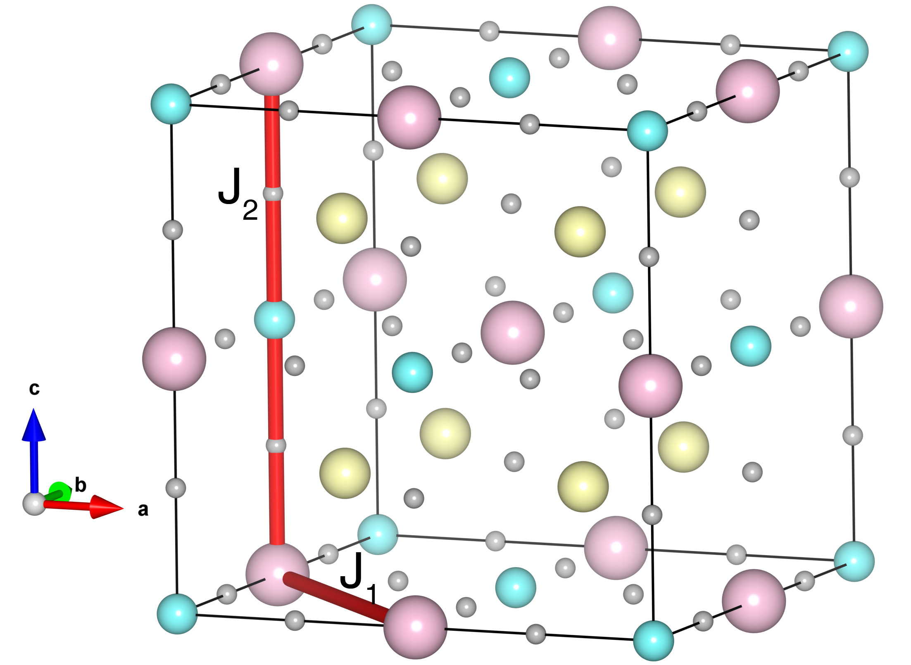

# Ba2NiWO6

## Crystal and Heisenberg exchanges

| shell    | distance (A&#778;) | exchange J (meV) |
|----------|--------------|------------------|
| 1        | 5.702109     | -0.019           |
| 2        | 8.064000     | -1.586           |

## Monte Carlo, corrected Monte Carlo (TMC*) and Exp. transition temperature

| Texp (K) | TMC (K) | TMC* (K) | S   | Error (%) |
|----------------------|--------------------|--------------------------------|-----|-----------|
| 48.0                   | 23.0                 | 46.0                           | 1.0 | 4.2       |

## INS data:
[J. Phys. Chem. Solids 60, 1173](https://doi.org/10.1016/S0022-3697(99)00075-X)

## Exp. transition temperature:
[J. Phys. Chem. Solids 60, 1173](https://doi.org/10.1016/S0022-3697(99)00075-X)
