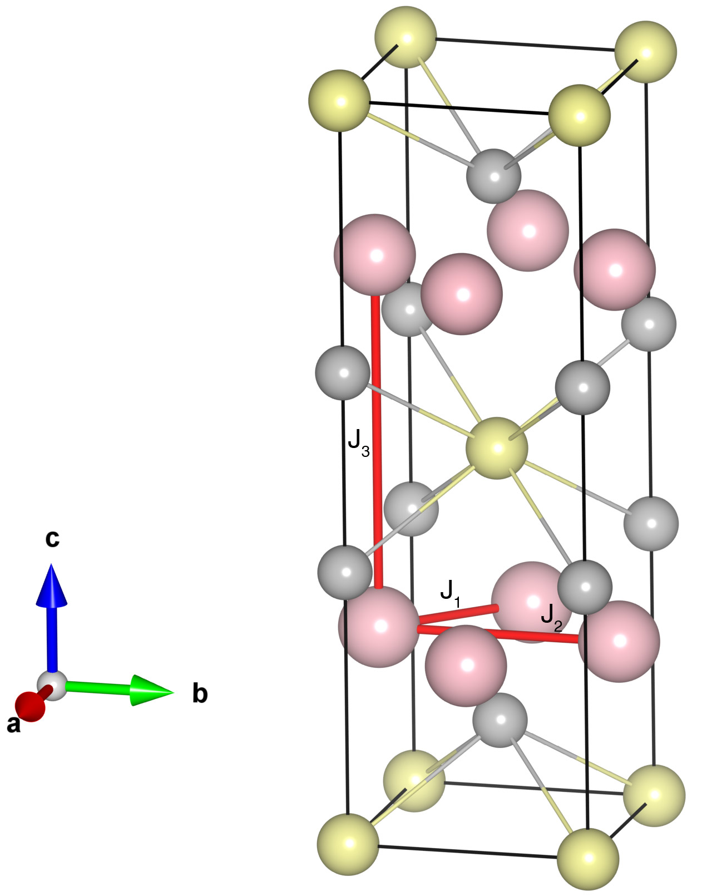

# BaMn2As2

## Crystal and Heisenberg exchanges

| shell    | distance (A&#778;) | exchange J (meV) |
|----------|--------------|------------------|
| 1        | 3.082038     | -101.250         |
| 2        | 4.358659     | -34.000          |
| 4        | 6.743528     | -4.500           |

## Monte Carlo, corrected Monte Carlo (TMC*) and Exp. transition temperature

| Texp (K) | TMC (K) | TMC* (K) | S   | Error (%) |
|----------------------|--------------------|--------------------------------|-----|-----------|
| 625.0                  | 460.0                | 644.0                          | 2.5 | 3.04      |

## INS data:
[Phys. Rev. B 95, 224401](https://journals.aps.org/prb/abstract/10.1103/PhysRevB.95.224401)

## Exp. transition temperature:
[Phys. Rev. B 95, 224401](https://journals.aps.org/prb/abstract/10.1103/PhysRevB.95.224401)
