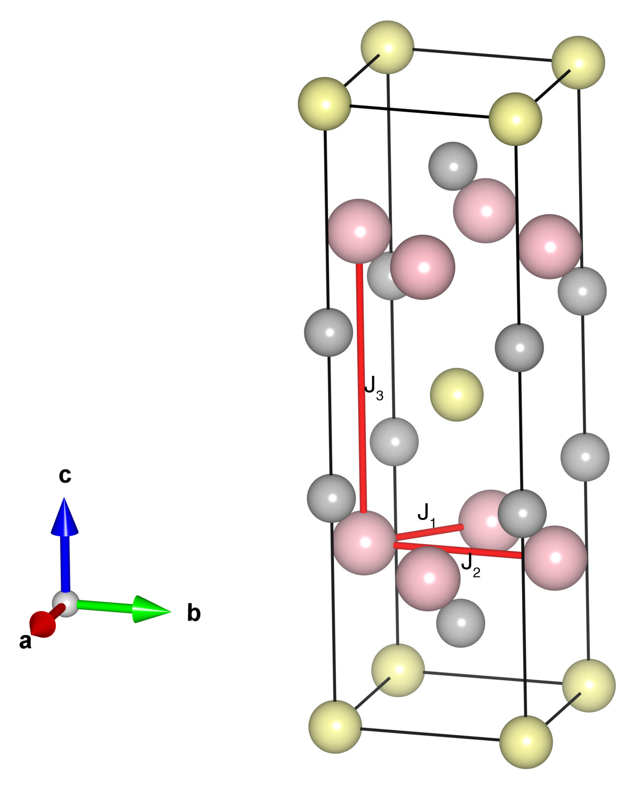

# BaMn2Bi2

## Crystal and Heisenberg exchanges

| shell    | distance (A&#778;) | exchange J (meV) |
|----------|--------------|------------------|
| 1        | 3.176727     | -54.250          |
| 2        | 4.492570     | -19.625          |
| 5        | 7.278180     | -3.150           |

## Monte Carlo, corrected Monte Carlo(TMC*) and Exp. transition temperature

| Texp (K) | TMC (K) | TMC* (K) | S   | Error (%) |
|----------------------|--------------------|--------------------------------|-----|-----------|
| 387.2                  | 238.0                | 333.2                          | 2.5 | 13.9      |

## INS data:
[Phys. Rev. B 89, 064417](https://journals.aps.org/prb/abstract/10.1103/PhysRevB.89.064417)

## Exp. transition temperature:
[Phys. Rev. B 89, 064417](https://journals.aps.org/prb/abstract/10.1103/PhysRevB.89.064417)
