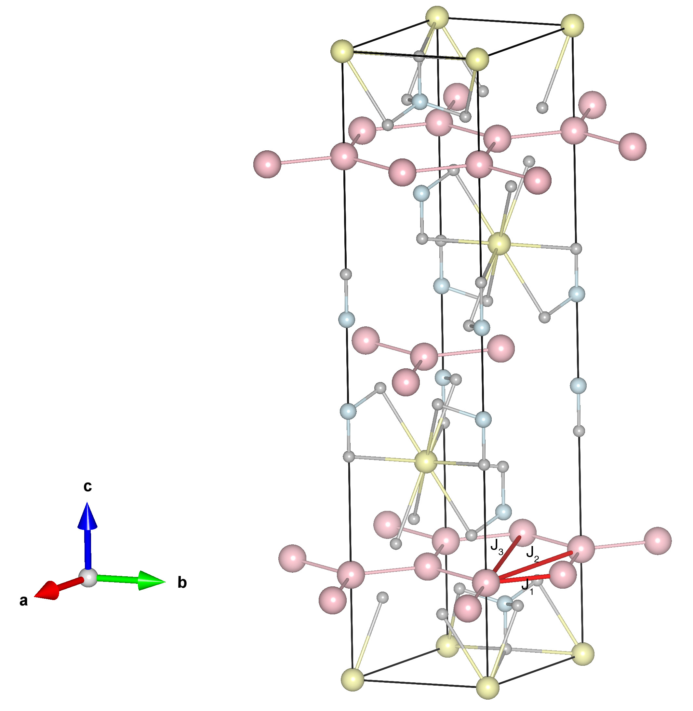

# BaNi2As2O8

## Crystal and Heisenberg exchanges

| shell    | distance (A&#778;) | exchange J (meV) |
|----------|--------------|------------------|
| 1        | 2.855040     | 0.690            |
| 2        | 4.945000     | 0.030            |
| 3        | 5.710016     | -1.510           |

## Monte Carlo, corrected Monte Carlo (TMC*) and Exp. transition temperature

| Texp (K) | TMC (K) | TMC* (K) | S   | Error (%) |
|----------------------|--------------------|--------------------------------|-----|-----------|
| 18.5                   | 11.0                 | 22.0                           | 1.0 | 18.9      |

## INS data:
[Phys. Rev. B 104, 214432](https://journals.aps.org/prb/abstract/10.1103/PhysRevB.104.214432)

## Exp. transition temperature:
[J. Phys.: Conf. Ser. 340 012012](https://iopscience.iop.org/article/10.1088/1742-6596/340/1/012012)
