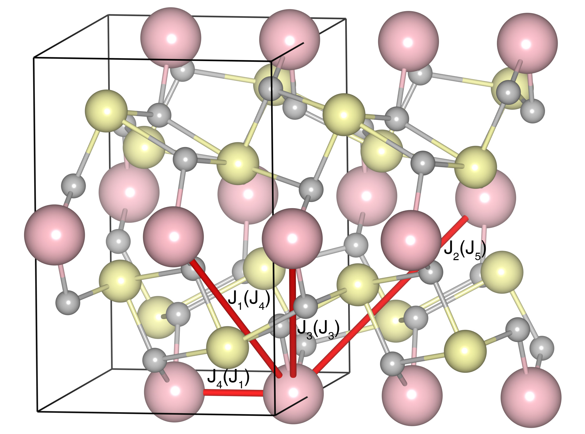

# Bi2CuO4

## Crystal and Heisenberg exchanges

| shell    | distance (A&#778;) | exchange J (meV) |
|----------|--------------|------------------|
| 1        | 2.909800     | -0.090           |
| 3        | 6.081663     | -0.275           |
| 4        | 6.332650     | -1.175           |
| 5        | 7.127739     | -0.125           |

## Monte Carlo, corrected Monte Carlo(TMC*) and Exp. transition temperature

| Texp (K) | TMC (K) | TMC* (K) | S   | Error (%) |
|----------------------|--------------------|--------------------------------|-----|-----------|
| 50.0                   | 17.5                 | 52.5                           | 0.5 | 5.0       |

## INS data:
[Phys. Rev. B 103, 134436](https://journals.aps.org/prb/abstract/10.1103/PhysRevB.103.134436)

## Exp. transition temperature:
[Phys. Rev. B 103, 134436](https://journals.aps.org/prb/abstract/10.1103/PhysRevB.103.134436)
