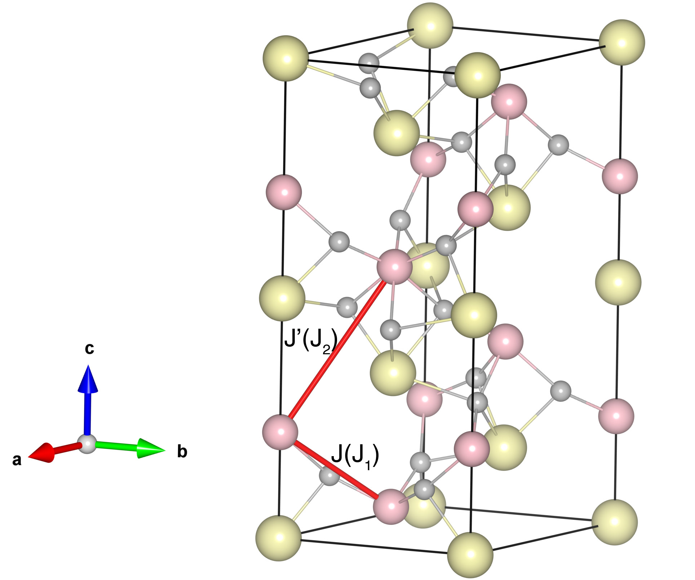

# BiFeO3

INS data:
[Phys. Rev. Lett. 108, 077202](https://doi.org/10.1103/PhysRevLett.108.077202)

## Crystal and Heisenberg exchanges

The structure and Heisenberg exchange interactions of BiFeO3:

| shell    | distance (A)| exchange J (eV) |
|----------|----------|-----------------|
|    1     | 4.000980 |   -0.02737500   |                
|----------|----------|-----------------|
|    2     | 5.629999 |   -0.0009375    |

## Temperature temperature

| Texp (K) | TMC (K) | TMC* (K) | S   | Error (%) |
|----------------------|--------------------|--------------------------------|-----|-----------|
| 650                 | 431               | 603.4                         | 2.5 | 7.17      |

