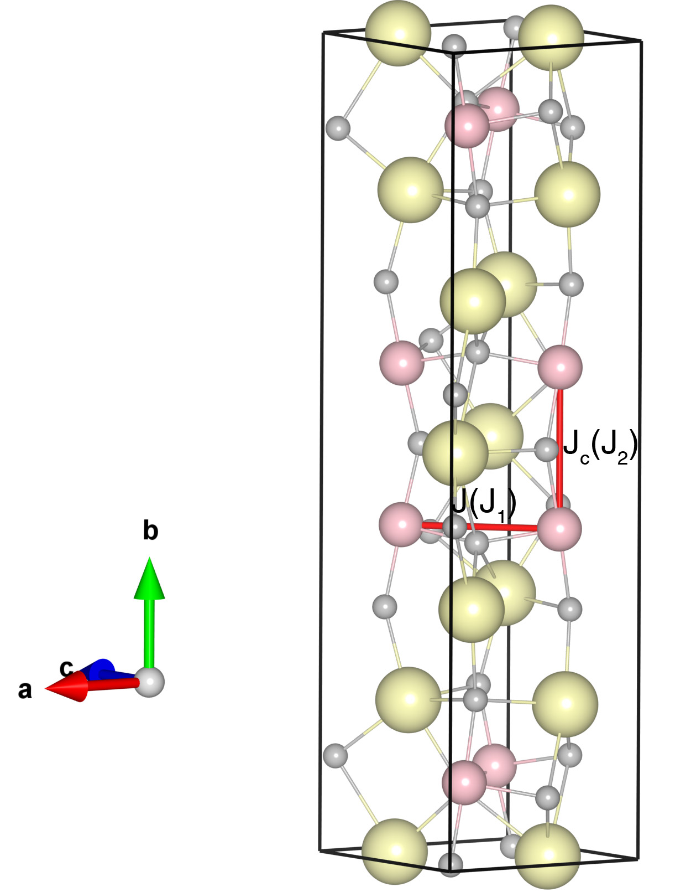

# Ca3Ru2O7

## Crystal and Heisenberg exchanges

| shell    | distance (A&#778;) | exchange J (meV) |
|----------|--------------|------------------|
| 1        | 3.846818     | 3.750            |
| 2        | 3.853577     | 6.500            |

## Monte Carlo, corrected Monte Carlo (TMC*) and Exp. transition temperature

| Texp (K) | TMC (K) | TMC* (K) | S   | Error (%) |
|----------------------|--------------------|--------------------------------|-----|-----------|
| 56.0                   | 30.0                 | 60.0                           | 1.0 | 7.1       |

## INS data:
[Phys. Rev. B 103, 085108](https://journals.aps.org/prb/abstract/10.1103/PhysRevB.103.085108)

## Exp. transition temperature:
[Phys. Rev. B 103, 085108](https://journals.aps.org/prb/abstract/10.1103/PhysRevB.103.085108)
