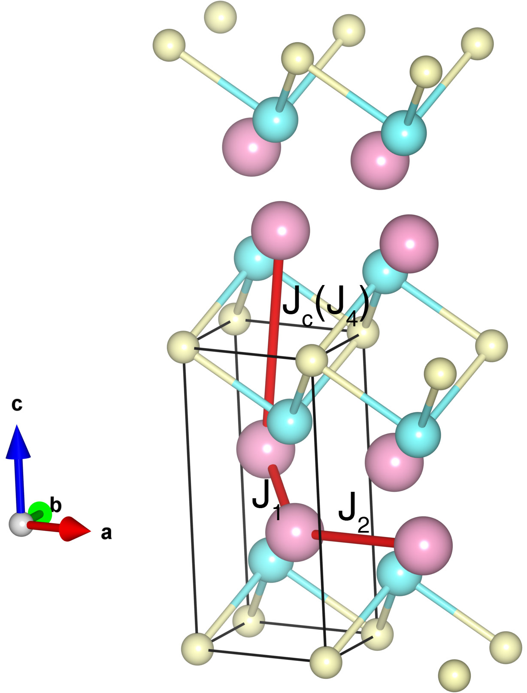

# CaMn2Sb2

## Crystal and Heisenberg exchanges

| shell    | distance (A&#778;) | exchange J (meV) |
|----------|--------------|------------------|
| 1        | 3.128781     | -23.700          |
| 2        | 4.528500     | -3.900           |
| 4        | 6.295564     | -1.530           |

## Monte Carlo, corrected Monte Carlo (TMC*) and Exp. transition temperature

| Texp (K) | TMC (K) | TMC* (K) | S   | Error (%) |
|----------------------|--------------------|--------------------------------|-----|-----------|
| 85.0                   | 69.0                 | 115.0                          | 1.5 | 35.3      |

## INS data:
[Phys. Rev. B 91, 180407(R)](https://doi.org/10.1103/PhysRevB.91.180407)

## Exp. transition temperature:
[Phys. Rev. B 91, 180407(R)](https://doi.org/10.1103/PhysRevB.91.180407)
