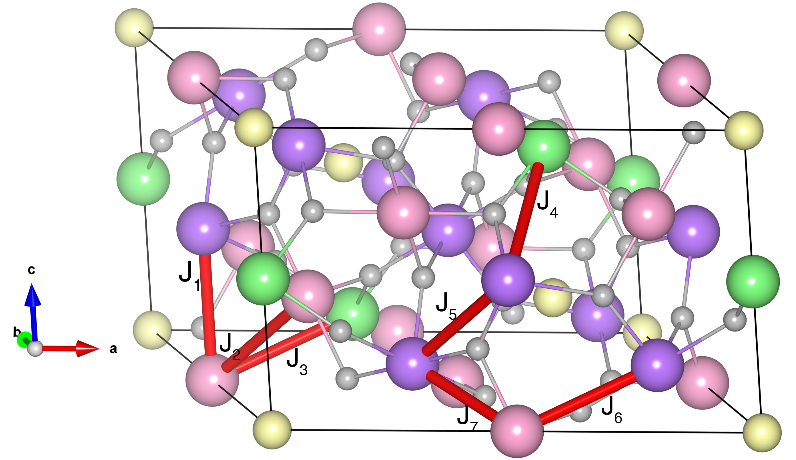

# CaMn7O12

## Crystal and Heisenberg exchanges

| shell    | distance (A&#778;) | exchange J (meV) |
|----------|--------------|------------------|
| 1        | 3.170970     | 11.130           |
| 2        | 3.198630     | -4.824           |
| 2        | 3.198630     | 5.474            |
| 3        | 3.685501     | -12.136          |
| 1        | 3.170970     | 11.130           |
| 2        | 3.198630     | -4.824           |
| 3        | 3.685501     | 4.444            |
| 3        | 3.685501     | 3.422            |
| 1        | 3.198630     | 5.474            |
| 2        | 3.685501     | 4.444            |

## Monte Carlo, corrected Monte Carlo (TMC*) and Exp. transition temperature

| Texp (K) | TMC (K) | TMC* (K) | S   | Error (%) |
|----------------------|--------------------|--------------------------------|-----|-----------|
| 90.0                   | 61.0                 | 122.0                          | 1.0 | 35.5      |

## INS data:
[Phys. Rev. B 109, 054417]( https://doi.org/10.1103/PhysRevB.109.054417)

## Exp. transition temperature:
[Phys. Rev. B 109, 054417]( https://doi.org/10.1103/PhysRevB.109.054417)
