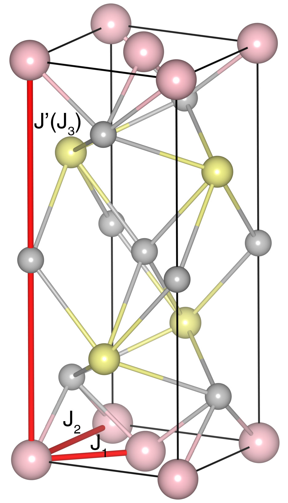

# CaMnBi2

## Crystal and Heisenberg exchanges

| shell    | distance (A&#778;) | exchange J (meV) |
|----------|--------------|------------------|
| 1        | 3.181981     | -58.500          |
| 2        | 4.500001     | -19.750          |
| 8        | 11.080003    | 0.250            |

## Monte Carlo, corrected Monte Carlo (TMC*) and Exp. transition temperature

| Texp (K) | TMC (K) | TMC* (K) | S   | Error (%) |
|----------------------|--------------------|--------------------------------|-----|-----------|
| 270.0                  | 209.0                | 292.6                          | 2.5 | 8.4       |

## INS data:
[Phys. Rev. B 95, 134405](https://journals.aps.org/prb/abstract/10.1103/PhysRevB.95.134405)

## Exp. transition temperature:
[Phys. Rev. B 95, 134405](https://journals.aps.org/prb/abstract/10.1103/PhysRevB.95.134405)
