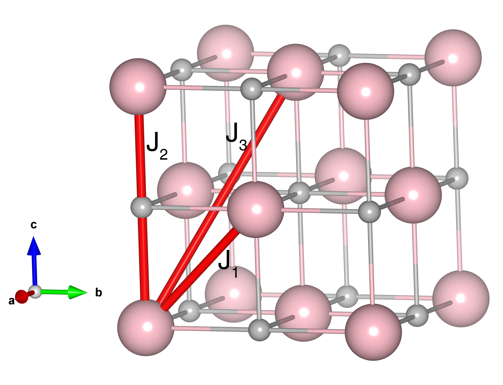

# CoO

## Crystal and Heisenberg exchanges

| shell    | distance (A&#778;) | exchange J (meV) |
|----------|--------------|------------------|
| 1        | 3.014396     | 1.395            |
| 2        | 4.263000     | -12.600          |
| 3        | 5.221087     | 3.015            |

## Monte Carlo, corrected Monte Carlo (TMC*) and Exp. transition temperature

| Texp (K) | TMC (K) | TMC* (K) | S   | Error (%) |
|----------------------|--------------------|--------------------------------|-----|-----------|
| 289.0                  | 201.0                | 335.0                          | 1.5 | 15.9      |

## INS data:
[J. Phys. Soc. Jpn. 75, 084708](https://doi.org/10.1143/JPSJ.75.084708)

## Exp. transition temperature:
[J. Phys. Soc. Jpn. 75, 084708](https://doi.org/10.1143/JPSJ.75.084708)
