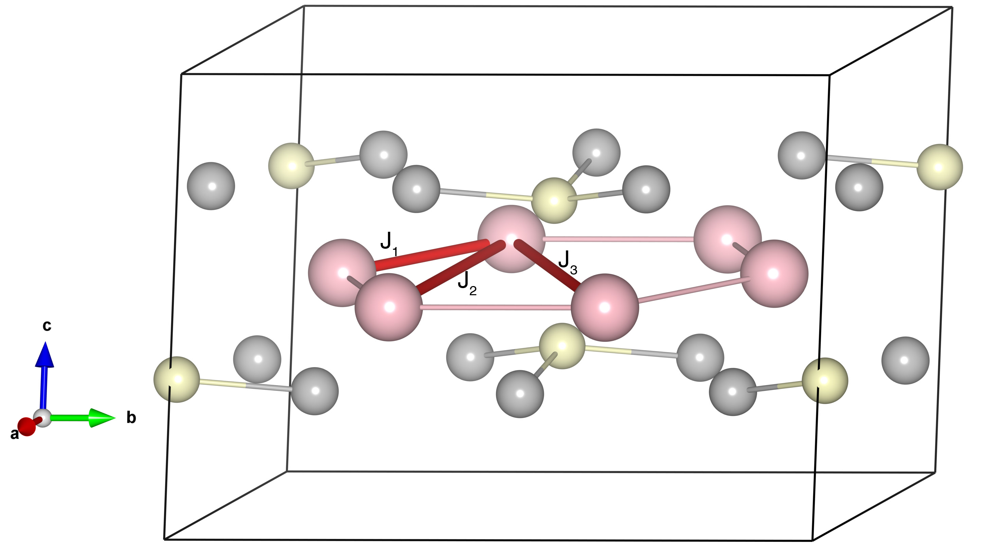

# CoPS3

## Crystal and Heisenberg exchanges

| shell    | distance (A&#778;) | exchange J (meV) |
|----------|--------------|------------------|
| 1        | 3.330957     | 3.083            |
| 2        | 5.769645     | -0.202           |
| 3        | 6.662812     | -6.750           |

## Monte Carlo, corrected Monte Carlo (TMC*) and Exp. transition temperature

| Texp (K) | TMC (K) | TMC* (K) | S   | Error (%) |
|----------------------|--------------------|--------------------------------|-----|-----------|
| 120.0                  | 61.0                 | 101.66                         | 1.5 | 15.3      |

## INS data:
[Phys. Rev. B 107, 054438](https://journals.aps.org/prb/abstract/10.1103/PhysRevB.107.054438)

## Exp. transition temperature:
[Phys. Rev. B 107, 054438](https://journals.aps.org/prb/abstract/10.1103/PhysRevB.107.054438)
