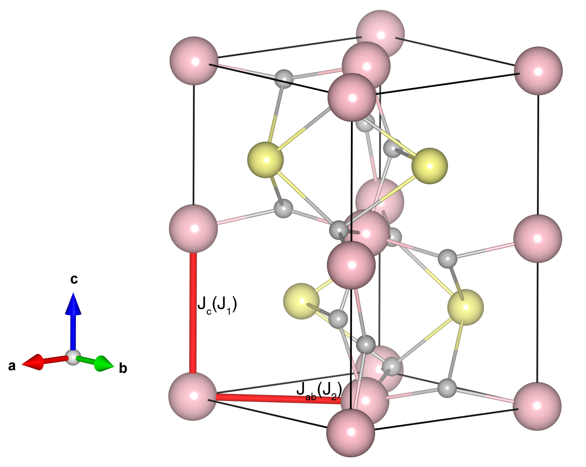

# YVO3

## Crystal and Heisenberg exchanges

**Space group:** Pnma (No. 62)

| shell    | distance (A&#778;) | exchange J (meV) |
|----------|--------------|------------------|
| 1        | 3.775477     |  6.00           |
| 2        | 3.845105     | -3.00           |

## Monte Carlo, corrected Monte Carlo (TMC*) and Exp. transition temperature

| Texp (K) | TMC (K) | TMC* (K) | S   | Error (%) |
|----------------------|--------------------|--------------------------------|-----|-----------|
| 118.0                  | 64.0                 | 124.0                          | 1.0 | 5.08       |

## INS data:
[Phys. Rev. B 105, 094412](https://journals.aps.org/prb/abstract/10.1103/PhysRevB.105.094412)

## Exp. transition temperature:
[Phys. Rev. B 105, 094412](https://journals.aps.org/prb/abstract/10.1103/PhysRevB.105.094412)
