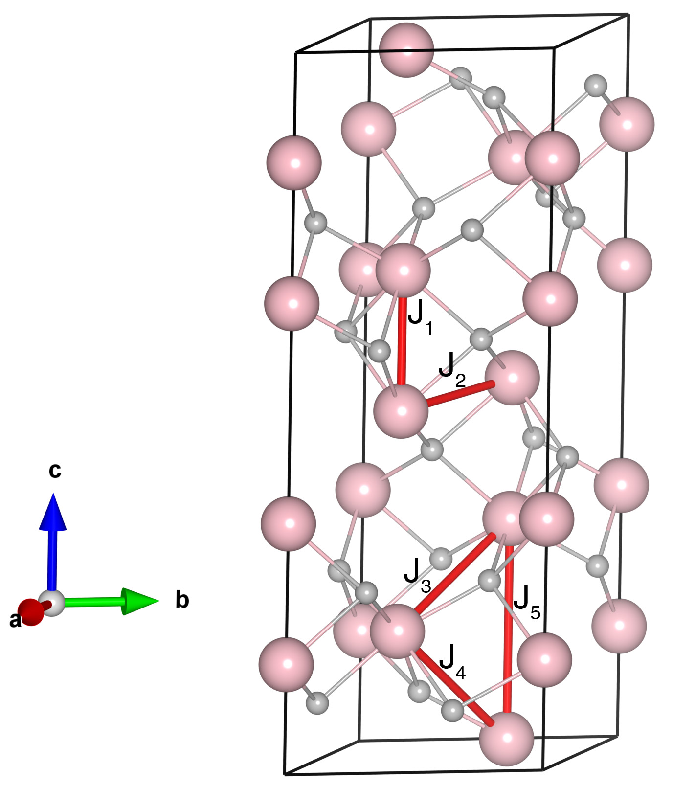

# Cr2O3

## Crystal and Heisenberg exchanges

| shell    | distance (A&#778;) | exchange J (meV) |
|----------|--------------|------------------|
| 1        | 2.651964     | -33.867          |
| 2        | 2.890037     | -15.363          |
| 3        | 3.426828     | -0.351           |
| 4        | 3.652598     | 0.076            |
| 5        | 4.147944     | -0.855           |

## Monte Carlo, corrected Monte Carlo (TMC*) and Exp. transition temperature

| Texp (K) | TMC (K) | TMC* (K) | S   | Error (%) |
|----------------------|--------------------|--------------------------------|-----|-----------|
| 308.0                  | 194.0                | 323.33                         | 1.5 | 4.97      |

## INS data:
[Physica, 48, 13](https://www.sciencedirect.com/science/article/abs/pii/0031891470901588)

## Exp. transition temperature:
[Physica, 48, 13](https://www.sciencedirect.com/science/article/abs/pii/0031891470901588)
