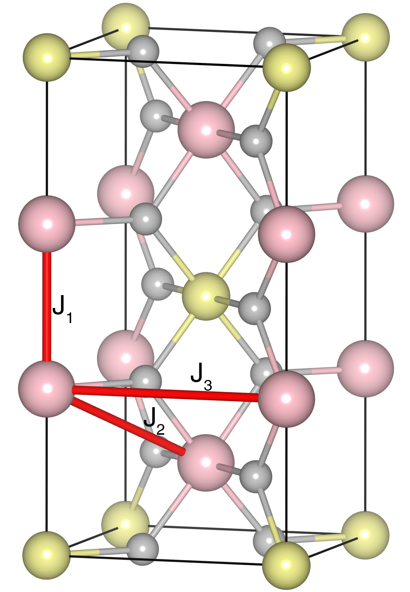

# Cr2TeO6

## Crystal and Heisenberg exchanges

| shell    | distance (A&#778;) | exchange J (meV) |
|----------|--------------|------------------|
| 1        | 2.983634     | -21.150          |
| 2        | 3.557204     | -2.329           |
| 3        | 4.546000     | 0.225            |

## Monte Carlo, corrected Monte Carlo (TMC*) and Exp. transition temperature

| Texp (K) | TMC (K) | TMC* (K) | S   | Error (%) |
|----------------------|--------------------|--------------------------------|-----|-----------|
| 93.0                   | 53.0                 | 88.33                          | 1.5 | 5.02      |

## INS data:
[Phys. Rev. Research 1, 033111](https://journals.aps.org/prresearch/abstract/10.1103/PhysRevResearch.1.033111)

## Exp. transition temperature:
[Phys. Rev. Research 1, 033111](https://journals.aps.org/prresearch/abstract/10.1103/PhysRevResearch.1.033111)
