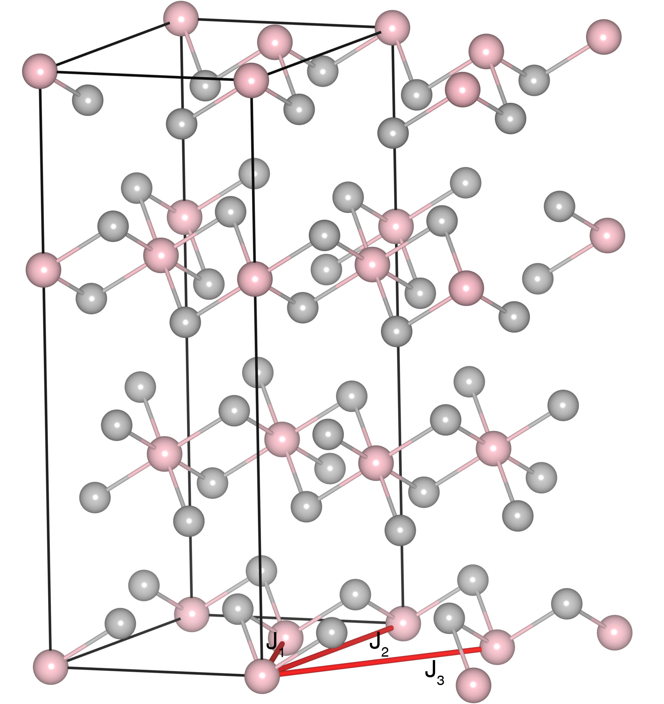

# CrBr3

## Crystal and Heisenberg exchanges

| shell    | distance (A&#778;) | exchange J (meV) |
|----------|--------------|------------------|
| 1        | 3.614214     | 3.341            |
| 3        | 6.260002     | 0.173            |
| 5        | 7.228428     | -0.153           |

## Monte Carlo, corrected Monte Carlo (TMC*) and Exp. transition temperature

| Texp (K) | TMC (K) | TMC* (K) | S   | Error (%) |
|----------------------|--------------------|--------------------------------|-----|-----------|
| 32.0                   | 20.0                 | 33.33                          | 1.5 | 4.2       |

## INS data:
[Phys. Rev. Lett. 129, 127201](https://journals.aps.org/prl/abstract/10.1103/PhysRevLett.129.127201)

## Exp. transition temperature:
[Phys. Rev. Lett. 129, 127201](https://journals.aps.org/prl/abstract/10.1103/PhysRevLett.129.127201)
