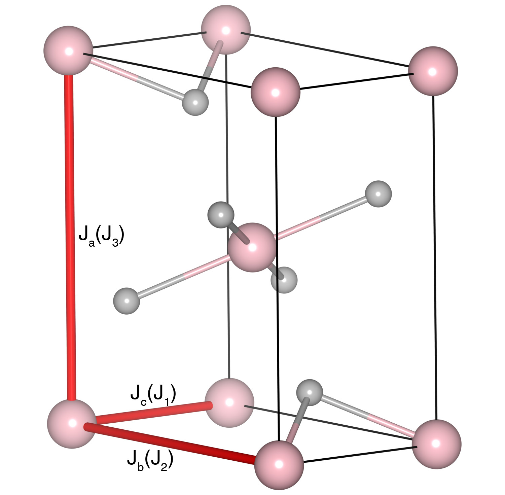

# CrCl2

## Crystal and Heisenberg exchanges

| shell    | distance (A&#778;) | exchange J (meV) |
|----------|--------------|------------------|
| 1        | 3.480000     | -4.520           |
| 3        | 5.957000     | -0.480           |
| 4        | 6.621000     | 0.004            |

## Monte Carlo, corrected Monte Carlo (TMC*) and Exp. transition temperature

| Texp (K) | TMC (K) | TMC* (K) | S   | Error (%) |
|----------------------|--------------------|--------------------------------|-----|-----------|
| 20.0                   | 15.0                 | 22.5                           | 2.0 | 12.5      |

## INS data:
[Phys. Rev. B 88, 104413](https://journals.aps.org/prb/abstract/10.1103/PhysRevB.88.104413)

## Exp. transition temperature:
[Phys. Rev. B 88, 104413](https://journals.aps.org/prb/abstract/10.1103/PhysRevB.88.104413)
