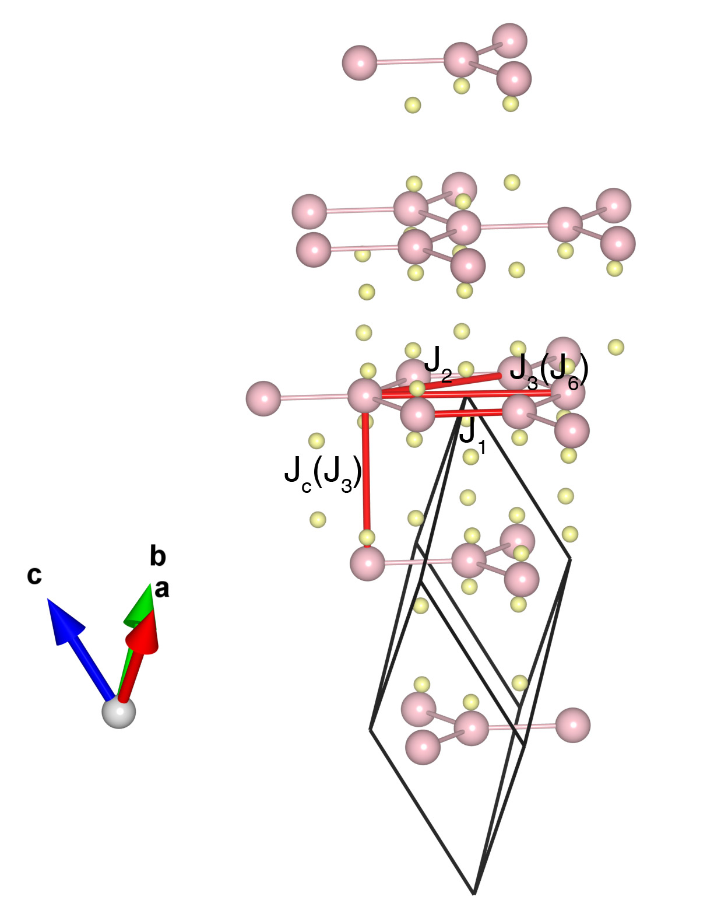

# CrCl3

## Crystal and Heisenberg exchanges

| shell    | distance (A&#778;) | exchange J (meV) |
|----------|--------------|------------------|
| 1        | 3.430802     | 2.138            |
| 2        | 5.813488     | 0.054            |
| 3        | 5.942000     | -0.018           |
| 6        | 6.861324     | -0.115           |

## Monte Carlo, corrected Monte Carlo (TMC*) and Exp. transition temperature

| Texp (K) | TMC (K) | TMC* (K) | S   | Error (%) |
|----------------------|--------------------|--------------------------------|-----|-----------|
| 14.0                   | 10.0                 | 16.6                           | 1.5 | 28.6      |

## INS data:
[2D Mater. 9 015006](https://iopscience.iop.org/article/10.1088/2053-1583/ac2e7a)

## Exp. transition temperature:
[2D Mater. 9 015006](https://iopscience.iop.org/article/10.1088/2053-1583/ac2e7a)
