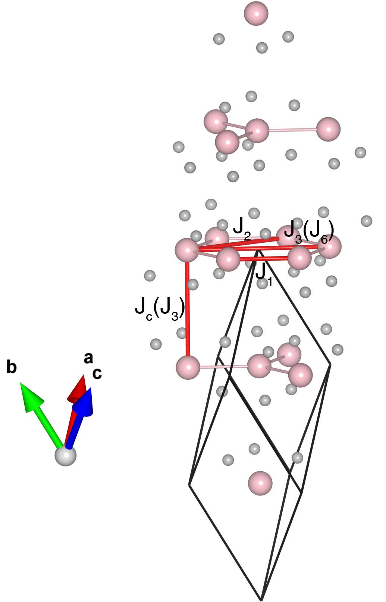

# CrI3

## Crystal and Heisenberg exchanges

| shell    | distance (A&#778;) | exchange J (meV) |
|----------|--------------|------------------|
| 1        | 3.964700     | 4.522            |
| 2        | 6.587423     | 1.327            |
| 3        | 6.867013     | 0.360            |
| 6        | 7.929357     | -0.180           |

## Monte Carlo, corrected Monte Carlo (TMC*) and Exp. transition temperature

| Texp (K) | TMC (K) | TMC* (K) | S   | Error (%) |
|----------------------|--------------------|--------------------------------|-----|-----------|
| 61.0                   | 39.0                 | 65.0                           | 1.5 | 6.6       |

## INS data:
[Phys. Rev. X 8, 041028](https://doi.org/10.1103/PhysRevX.8.041028)

## Exp. transition temperature:
[Phys. Rev. X 8, 041028](https://doi.org/10.1103/PhysRevX.8.041028)
