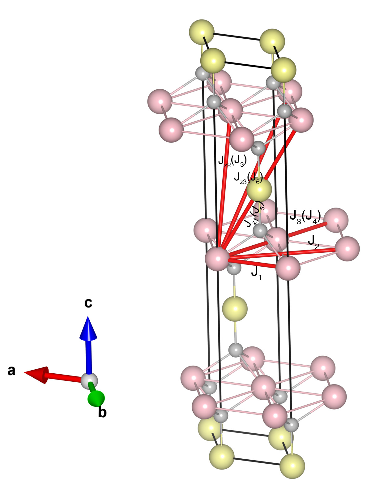

# CuFeO2

## Crystal and Heisenberg exchanges

| shell    | distance (A&#778;) | exchange J (meV) |
|----------|--------------|------------------|
| 1        | 3.034500     | -0.719           |
| 2        | 5.255908     | -0.375           |
| 3        | 5.984203     | 0.219            |
| 4        | 6.069000     | -0.500           |
| 5        | 6.709610     | -0.188           |
| 6        | 7.363903     | -0.156           |

## Monte Carlo, corrected Monte Carlo (TMC*) and Exp. transition temperature

| Texp (K) | TMC (K) | TMC* (K) | S   | Error (%) |
|----------------------|--------------------|--------------------------------|-----|-----------|
| 11.0                   | 7.5                  | 10.5                           | 2.5 | 4.5       |

## INS data:
[Phys. Rev. B 82, 020404(R)](https://journals.aps.org/prb/abstract/10.1103/PhysRevB.82.020404)

## Exp. transition temperature:
[Phys. Rev. B 82, 020404(R)](https://journals.aps.org/prb/abstract/10.1103/PhysRevB.82.020404)
