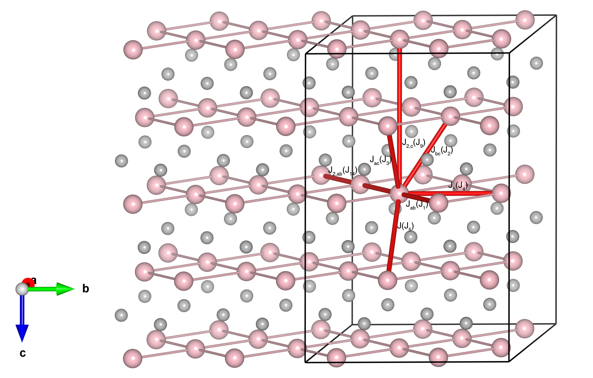

# CuO

## Crystal and Heisenberg exchanges

| shell    | distance (A&#778;) | exchange J (meV) |
|----------|--------------|------------------|
| 1        | 2.900484     | -0.625           |
| 2        | 3.082969     | -0.775           |
| 3        | 3.173290     | 0.932            |
| 4        | 3.422600     | 0.098            |
| 5        | 3.748473     | -22.850          |
| 14       | 5.800969     | -0.792           |

## Monte Carlo, corrected Monte Carlo (TMC*) and Exp. transition temperature

| Texp (K) | TMC (K) | TMC* (K) | S   | Error (%) |
|----------------------|--------------------|--------------------------------|-----|-----------|
| 213.0                  | 72.0                 | 216.0                          | 0.5 | 1.4       |

## INS data:
[Phys. Rev. B 97, 144401](https://journals.aps.org/prb/abstract/10.1103/PhysRevB.97.144401)

## Exp. transition temperature:
[Phys. Rev. B 97, 144401](https://journals.aps.org/prb/abstract/10.1103/PhysRevB.97.144401)
