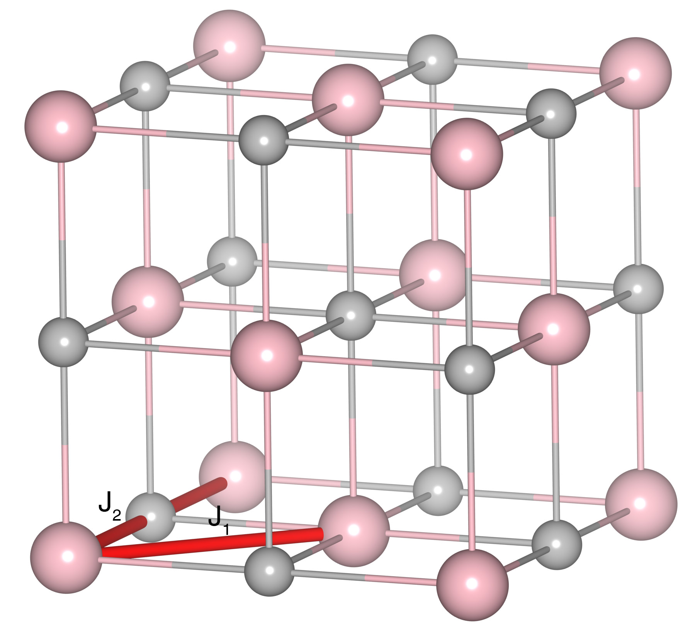

# EuO

## Crystal and Heisenberg exchanges

| shell    | distance (A&#778;) | exchange J (meV) |
|----------|--------------|------------------|
| 1        | 3.637287     | 1.280            |
| 2        | 5.143900     | 0.251            |

## Monte Carlo, corrected Monte Carlo (TMC*) and Exp. transition temperature

| Texp (K) | TMC (K) | TMC* (K) | S   | Error (%) |
|----------------------|--------------------|--------------------------------|-----|-----------|
| 69.15                  | 52.0                 | 66.86                          | 3.5 | 3.3       |

## INS data:
[Phys. Rev. B 14, 4897](https://journals.aps.org/prb/abstract/10.1103/PhysRevB.14.4897)

## Exp. transition temperature:
[Phys. Rev. B 14, 4897](https://journals.aps.org/prb/abstract/10.1103/PhysRevB.14.4897)
