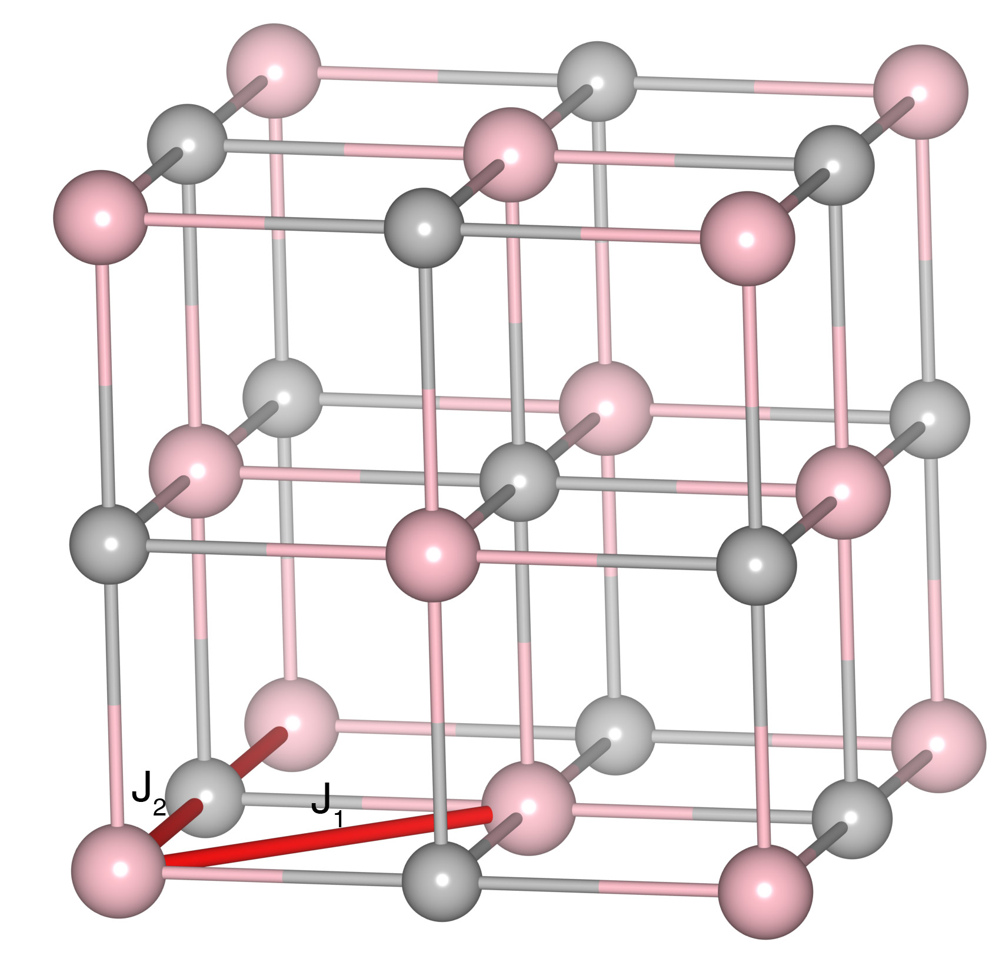

# EuS

## Crystal and Heisenberg exchanges

| shell    | distance (A&#778;) | exchange J (meV) |
|----------|--------------|------------------|
| 1        | 4.212235     | 0.498            |
| 2        | 5.957000     | -0.249           |

## Monte Carlo, corrected Monte Carlo (TMC*) and Exp. transition temperature

| Texp (K) | TMC (K) | TMC* (K) | S   | Error (%) |
|----------------------|--------------------|--------------------------------|-----|-----------|
| 16.57                  | 13.0                 | 16.71                          | 3.5 | 0.8       |

## INS data:
[Phys. Rev. B 14, 4897](https://journals.aps.org/prb/abstract/10.1103/PhysRevB.14.4897)

## Exp. transition temperature:
[Phys. Rev. B 14, 4897](https://journals.aps.org/prb/abstract/10.1103/PhysRevB.14.4897)
