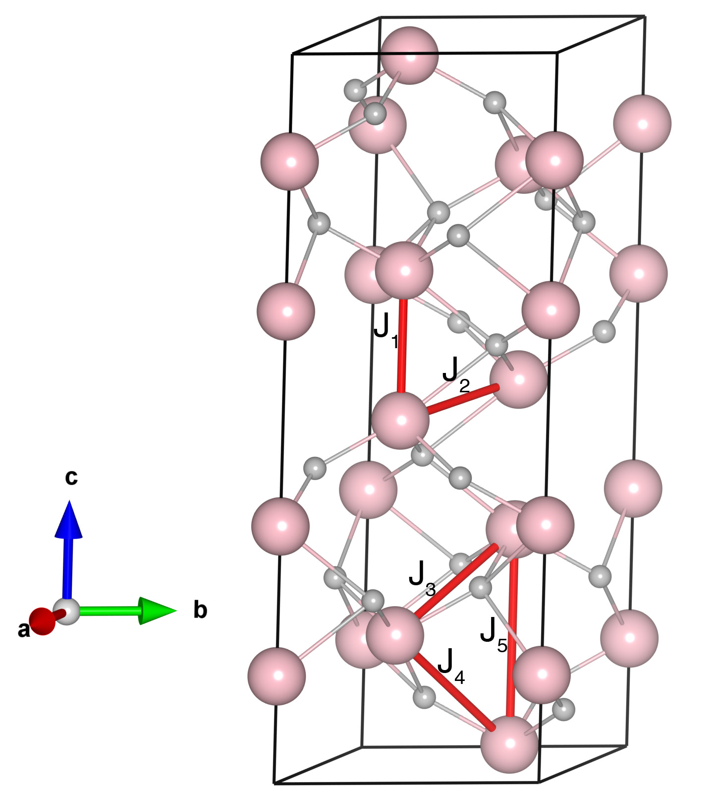

# Fe2O3

## Crystal and Heisenberg exchanges

| shell    | distance (A&#778;) | exchange J (meV) |
|----------|--------------|------------------|
| 1        | 2.827056     | 6.463            |
| 2        | 2.955437     | 1.725            |
| 3        | 3.398666     | -32.000          |
| 4        | 3.703050     | -25.000          |
| 5        | 4.054775     | -1.077           |

## Monte Carlo, corrected Monte Carlo (TMC*) and Exp. transition temperature

| Texp (K) | TMC (K) | TMC* (K) | S   | Error (%) |
|----------------------|--------------------|--------------------------------|-----|-----------|
| 960.0                  | 730.0                | 1022.0                         | 2.5 | 6.4       |

## INS data:
[phys. stat. sol. 42, 241](https://doi.org/10.1002/pssb.19700420125)

## Exp. transition temperature:
[phys. stat. sol. 42, 241](https://doi.org/10.1002/pssb.19700420125)
