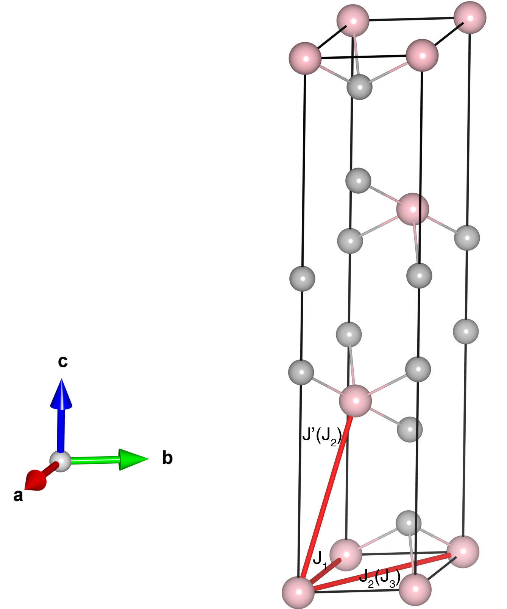

# FeCl2

## Crystal and Heisenberg exchanges

| shell    | distance (A&#778;) | exchange J (meV) |
|----------|--------------|------------------|
| 1        | 3.603000     | 0.680            |
| 2        | 6.204444     | -0.090           |
| 3        | 6.240579     | -0.030           |

## Monte Carlo, corrected Monte Carlo (TMC*) and Exp. transition temperature

| Texp (K) | TMC (K) | TMC* (K) | S   | Error (%) |
|----------------------|--------------------|--------------------------------|-----|-----------|
| 23.55                  | 11.5                 | 23.0                           | 1.0 | 2.3       |

## INS data:
[Phys. Rev. B 5, 2607](https://doi.org/10.1103/PhysRevB.5.2607)

## Exp. transition temperature:
[Phys. Rev. B 5, 2607](https://doi.org/10.1103/PhysRevB.5.2607)
