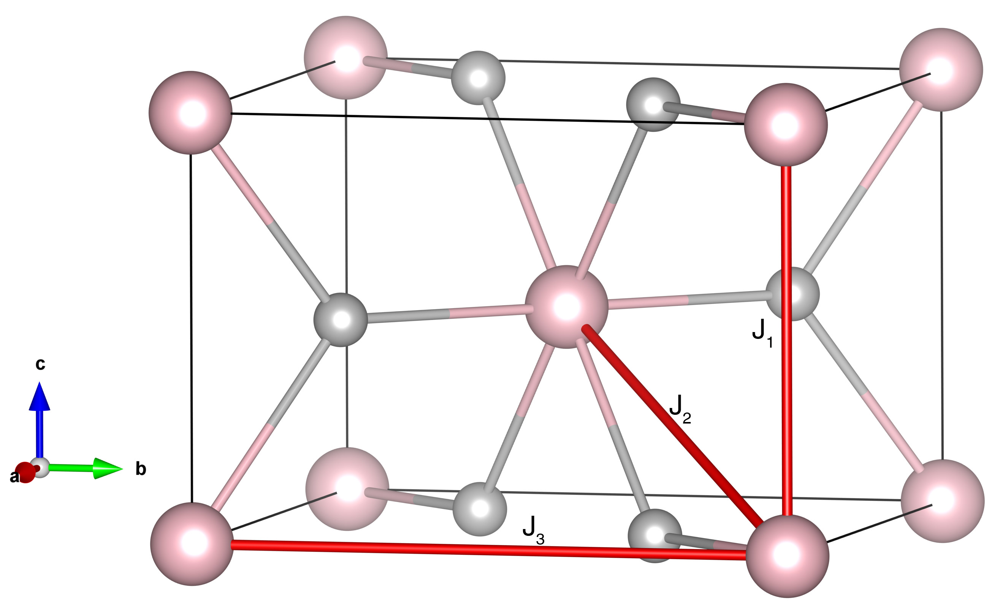

# FeF2

## Crystal and Heisenberg exchanges

| shell    | distance (A&#778;) | exchange J (meV) |
|----------|--------------|------------------|
| 1        | 3.309100     | 0.024            |
| 2        | 3.710332     | -1.805           |
| 3        | 4.696600     | 0.096            |

## Monte Carlo, corrected Monte Carlo (TMC*) and Exp. transition temperature

| Texp (K) | TMC (K) | TMC* (K) | S   | Error (%) |
|----------------------|--------------------|--------------------------------|-----|-----------|
| 78.4                   | 55.0                 | 82.5                           | 2.0 | 5.2       |

## INS data:
[ J. Phys. C: Solid State Phys. 3 307](https://iopscience.iop.org/article/10.1088/0022-3719/3/2/013)

## Exp. transition temperature:
[ J. Phys. C: Solid State Phys. 3 307](https://iopscience.iop.org/article/10.1088/0022-3719/3/2/013)
