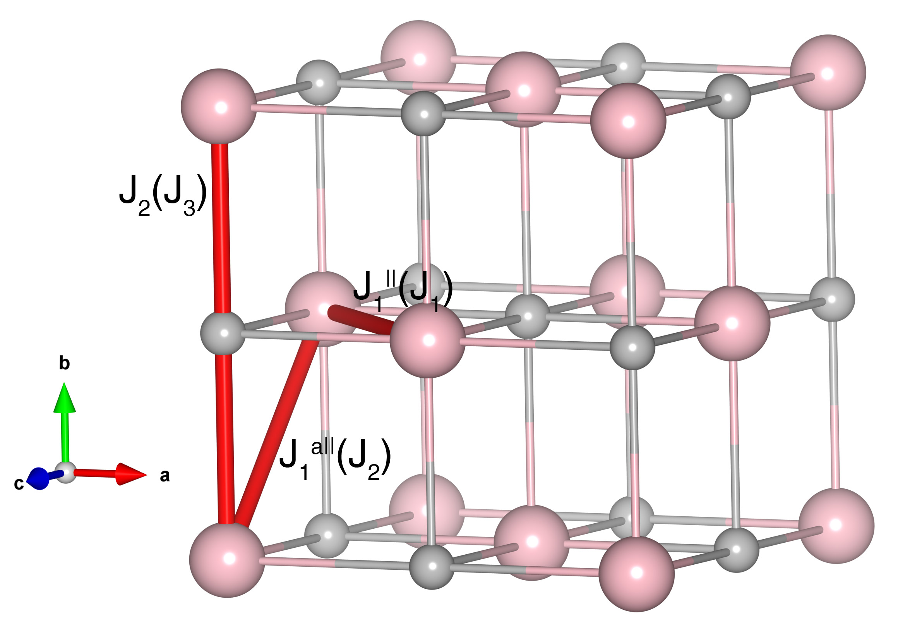

# FeO

## Crystal and Heisenberg exchanges

| shell    | distance (A&#778;) | exchange J (meV) |
|----------|--------------|------------------|
| 1        | 3.045720     | 3.669            |
| 2        | 3.051815     | 2.043            |
| 3        | 4.311610     | -6.465           |

## Monte Carlo, corrected Monte Carlo (TMC*) and Exp. transition temperature

| Texp (K) | TMC (K) | TMC* (K) | S   | Error (%) |
|----------------------|--------------------|--------------------------------|-----|-----------|
| 198.0                  | 148.0                | 222.0                          | 2.0 | 12.1      |

## INS data:
[Phys. Rev. B 18, 1317](https://journals.aps.org/prb/abstract/10.1103/PhysRevB.18.1317)

## Exp. transition temperature:
[Phys. Rev. B 18, 1317](https://journals.aps.org/prb/abstract/10.1103/PhysRevB.18.1317)
