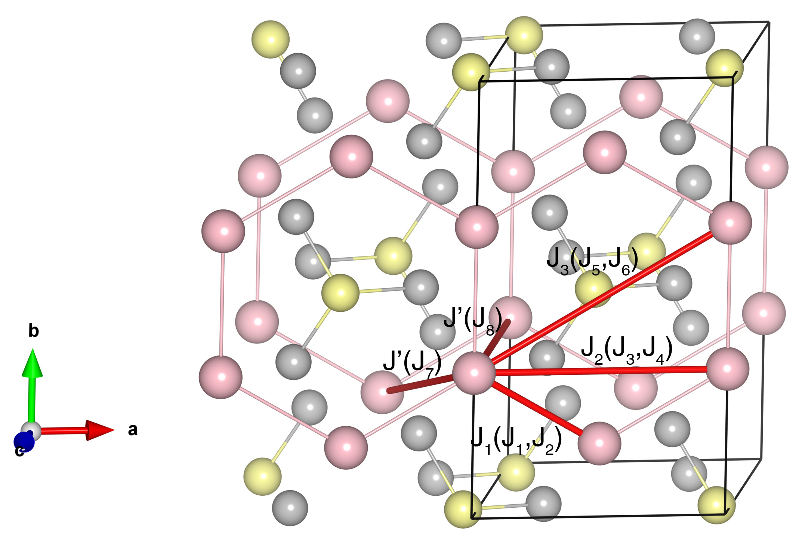

# FePS3

## Crystal and Heisenberg exchanges

| shell    | distance (A&#778;) | exchange J (meV) |
|----------|--------------|------------------|
| 1        | 3.421008     | 11.680           |
| 2        | 3.433520     | 11.680           |
| 3        | 5.930000     | -0.320           |
| 4        | 5.933871     | -0.320           |
| 5        | 6.715983     | -0.058           |
| 6        | 6.720000     | -0.058           |
| 7        | 6.846480     | -7.680           |
| 8        | 6.852296     | -7.680           |

## Monte Carlo, corrected Monte Carlo (TMC*) and Exp. transition temperature

| Texp (K) | TMC (K) | TMC* (K) | S   | Error (%) |
|----------------------|--------------------|--------------------------------|-----|-----------|
| 120.0                  | 91.0                 | 136.5                          | 2.0 | 13.8      |

## INS data:
[Phys. Rev. B 94, 214407](https://journals.aps.org/prb/abstract/10.1103/PhysRevB.94.214407)

## Exp. transition temperature:
[Phys. Rev. B 94, 214407](https://journals.aps.org/prb/abstract/10.1103/PhysRevB.94.214407)
