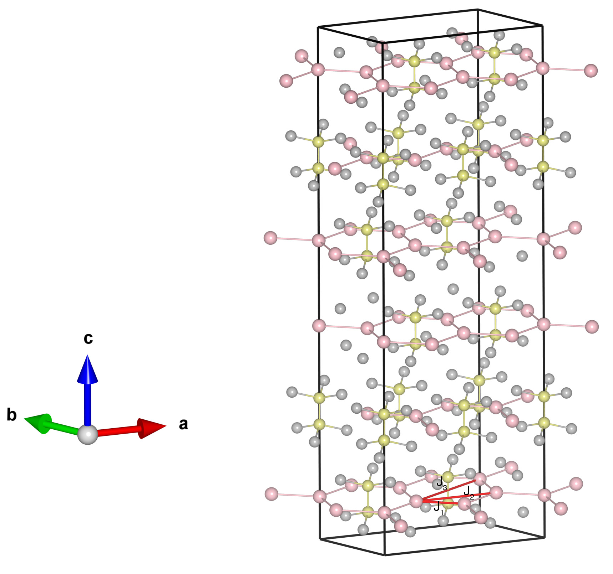

# FePSe3

## Crystal and Heisenberg exchanges

| shell    | distance (A&#778;) | exchange J (meV) |
|----------|--------------|------------------|
| 1        | 3.615373     | 5.280            |
| 2        | 6.262000     | -0.480           |
| 4        | 7.230738     | -5.120           |

## Monte Carlo, corrected Monte Carlo (TMC*) and Exp. transition temperature

| Texp (K) | TMC (K) | TMC* (K) | S   | Error (%) |
|----------------------|--------------------|--------------------------------|-----|-----------|
| 110.0                  | 75.0                 | 112.5                          | 2.0 | 2.3       |

## INS data:
[npj Quantum Materials 9:40](https://www.nature.com/articles/s41535-024-00651-5)

## Exp. transition temperature:
[npj Quantum Materials 9:40](https://www.nature.com/articles/s41535-024-00651-5)
