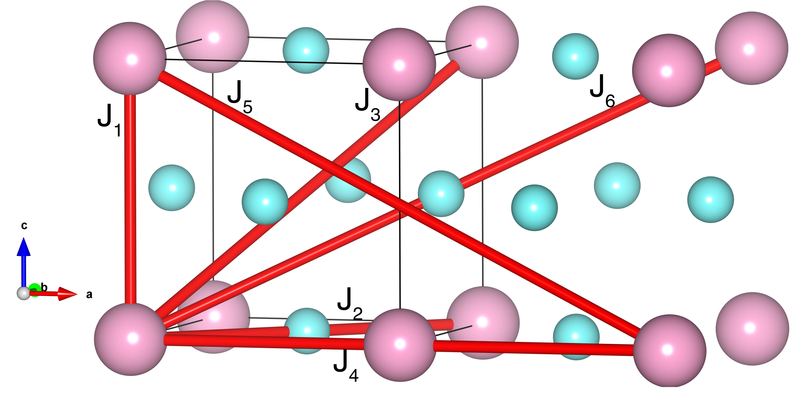

# FePt3

## Crystal and Heisenberg exchanges

| shell    | distance (A&#778;) | exchange J (meV) |
|----------|--------------|------------------|
| 1        | 3.864000     | 7.950            |
| 2        | 5.464521     | -4.465           |
| 3        | 6.692644     | 3.811            |
| 4        | 7.728000     | 1.470            |
| 5        | 8.640167     | 0.272            |
| 6        | 9.464829     | -0.980           |

## Monte Carlo, corrected Monte Carlo (TMC*) and Exp. transition temperature

| Texp (K) | TMC (K) | TMC* (K) | S   | Error (%) |
|----------------------|--------------------|--------------------------------|-----|-----------|
| 170.0                  | 104.0                | 167.03                         | 1.65 | 1.8       |

## INS data:
[J. Phys. Soc. Jpn. 49, 985](https://doi.org/10.1143/JPSJ.49.985)

## Exp. transition temperature:
[J. Phys. Soc. Jpn. 49, 985](https://doi.org/10.1143/JPSJ.49.985)
