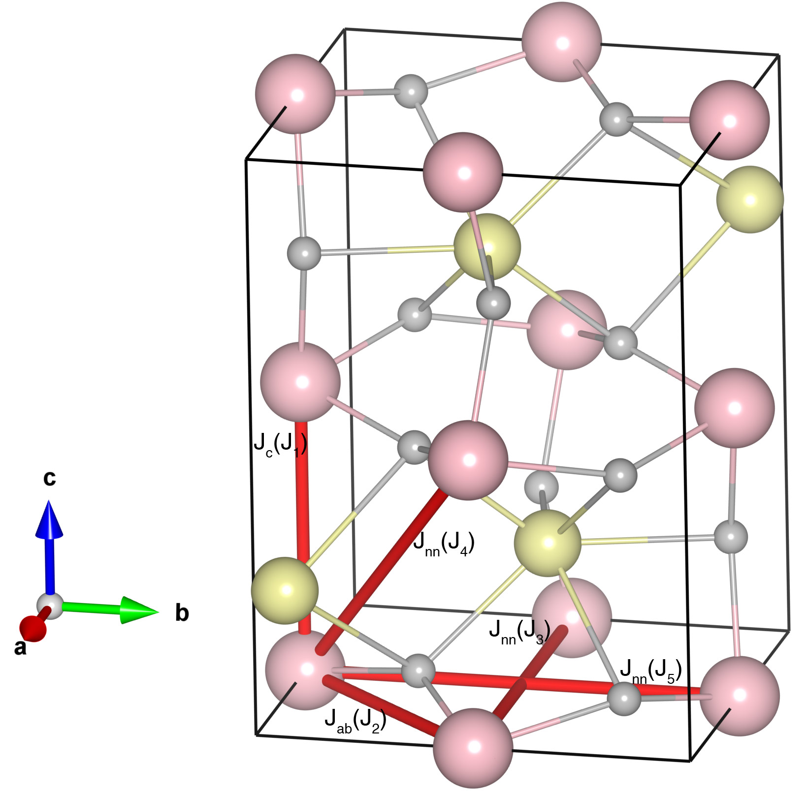

# HoFeO3

## Crystal and Heisenberg exchanges

| shell    | distance (A&#778;) | exchange J (meV) |
|----------|--------------|------------------|
| 1        | 3.801000     | -30.631          |
| 2        | 3.844365     | -29.775          |
| 3        | 5.278000     | -0.938           |
| 4        | 5.406176     | -0.938           |
| 5        | 5.591000     | -0.938           |

## Monte Carlo, corrected Monte Carlo (TMC*) and Exp. transition temperature

| Texp (K) | TMC (K) | TMC* (K) | S   | Error (%) |
|----------------------|--------------------|--------------------------------|-----|-----------|
| 647.0                  | 456.0                | 638.4                          | 2.5 | 1.3       |

## INS data:
[j.jmmm.2020.166855](https://doi.org/10.1016/j.jmmm.2020.166855)

## Exp. transition temperature:
[j.jmmm.2020.166855](https://doi.org/10.1016/j.jmmm.2020.166855)
