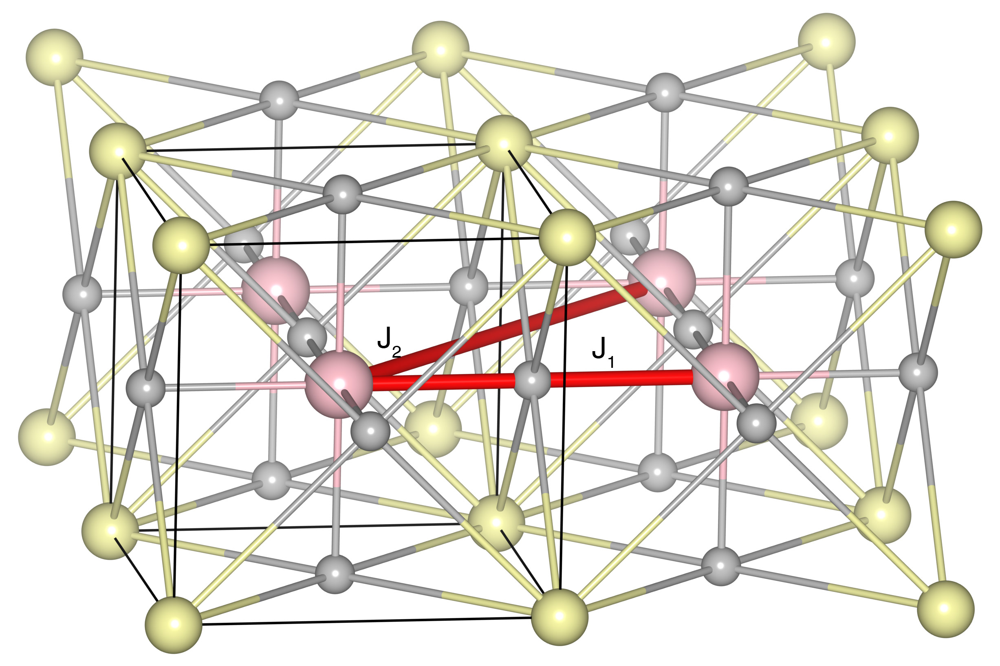

# KCoF3

## Crystal and Heisenberg exchanges

| shell    | distance (A&#778;) | exchange J (meV) |
|----------|--------------|------------------|
| 1        | 4.071000     | -2.417           |
| 2        | 5.757263     | -0.043           |

## Monte Carlo, corrected Monte Carlo (TMC*) and Exp. transition temperature

| Texp (K) | TMC (K) | TMC* (K) | S   | Error (%) |
|----------------------|--------------------|--------------------------------|-----|-----------|
| 114.0                  | 33.0                 | 99.0                           | 0.5 | 13.2      |

## INS data:
[J. Phys. C: Solid State Phys. 4 2139](https://iopscience.iop.org/article/10.1088/0022-3719/4/14/028)

## Exp. transition temperature:
[J. Phys. C: Solid State Phys. 4 2127](https://iopscience.iop.org/article/10.1088/0022-3719/4/14/027)
