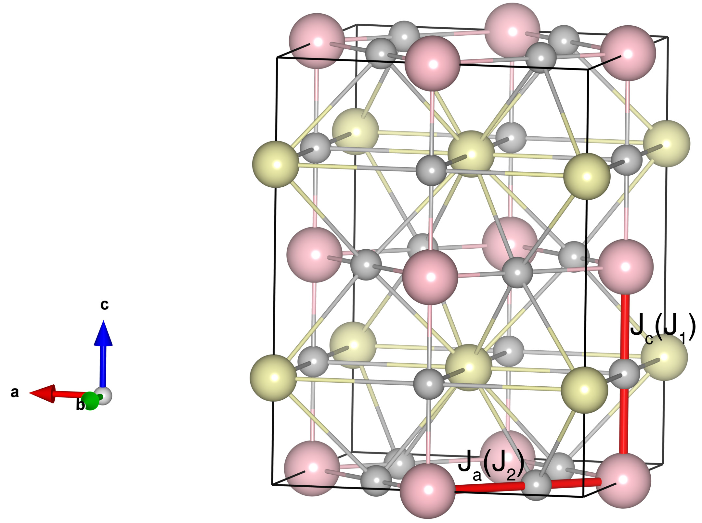

# KCuF3

## Crystal and Heisenberg exchanges

| shell    | distance (A&#778;) | exchange J (meV) |
|----------|--------------|------------------|
| 1        | 3.926400     | -8.500           |
| 2        | 4.143929     | 0.135            |

## Monte Carlo, corrected Monte Carlo (TMC*) and Exp. transition temperature

| Texp (K) | TMC (K) | TMC* (K) | S   | Error (%) |
|----------------------|--------------------|--------------------------------|-----|-----------|
| 39.0                   | 15.0                 | 45.0                           | 0.5 | 15.4      |

## INS data:
[J. Phys. C: Solid State Phys. 12 L739](https://iopscience.iop.org/article/10.1088/0022-3719/12/18/008)

## Exp. transition temperature:
[J. Phys. C: Solid State Phys. 12 L739](https://iopscience.iop.org/article/10.1088/0022-3719/12/18/008)
