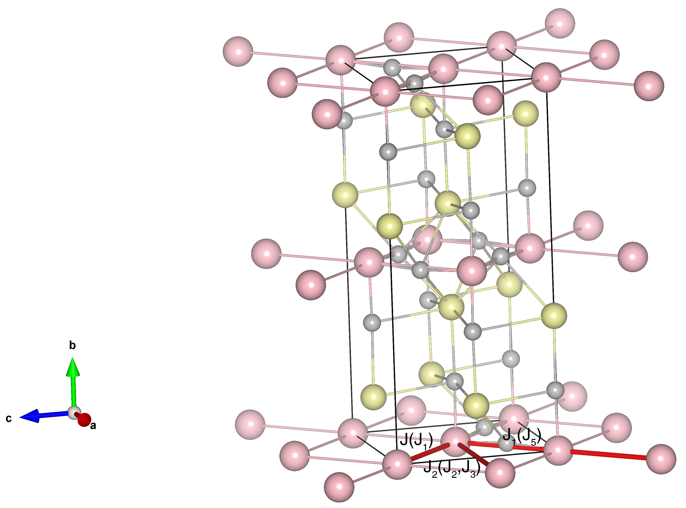

# La2CoO4

## Crystal and Heisenberg exchanges

| shell    | distance (A&#778;) | exchange J (meV) |
|----------|--------------|------------------|
| 1        | 3.881309     | -21.802          |
| 2        | 5.488000     | -0.968           |
| 3        | 5.490000     | -0.968           |
| 5        | 7.762618     | -0.315           |

## Monte Carlo, corrected Monte Carlo (TMC*) and Exp. transition temperature

| Texp (K) | TMC (K) | TMC* (K) | S   | Error (%) |
|----------------------|--------------------|--------------------------------|-----|-----------|
| 275.0                  | 161.0                | 268.3                          | 1.5 | 2.4       |

## INS data:
[Phys. Rev. B 82, 184425](https://journals.aps.org/prb/abstract/10.1103/PhysRevB.82.184425)

## Exp. transition temperature:
[Phys. Rev. B 82, 184425](https://journals.aps.org/prb/abstract/10.1103/PhysRevB.82.184425)
