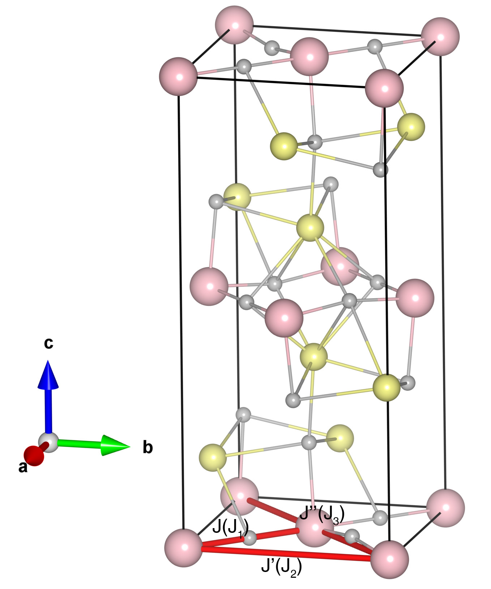

# La2NiO4

## Crystal and Heisenberg exchanges

| shell    | distance (A&#778;) | exchange J (meV) |
|----------|--------------|------------------|
| 1        | 3.888734     | -28.200          |
| 2        | 5.499500     | -1.300           |
| 4        | 7.777467     | 0.200            |

## Monte Carlo, corrected Monte Carlo (TMC*) and Exp. transition temperature

| Texp (K) | TMC (K) | TMC* (K) | S   | Error (%) |
|----------------------|--------------------|--------------------------------|-----|-----------|
| 328.0                  | 220.0                | 440.0                          | 1.0 | 34.1      |

## INS data:
[Phys. Rev. Research 5, 033113](https://doi.org/10.1103/PhysRevResearch.5.033113)

## Exp. transition temperature:
[Phys. Rev. Research 5, 033113](https://doi.org/10.1103/PhysRevResearch.5.033113)
