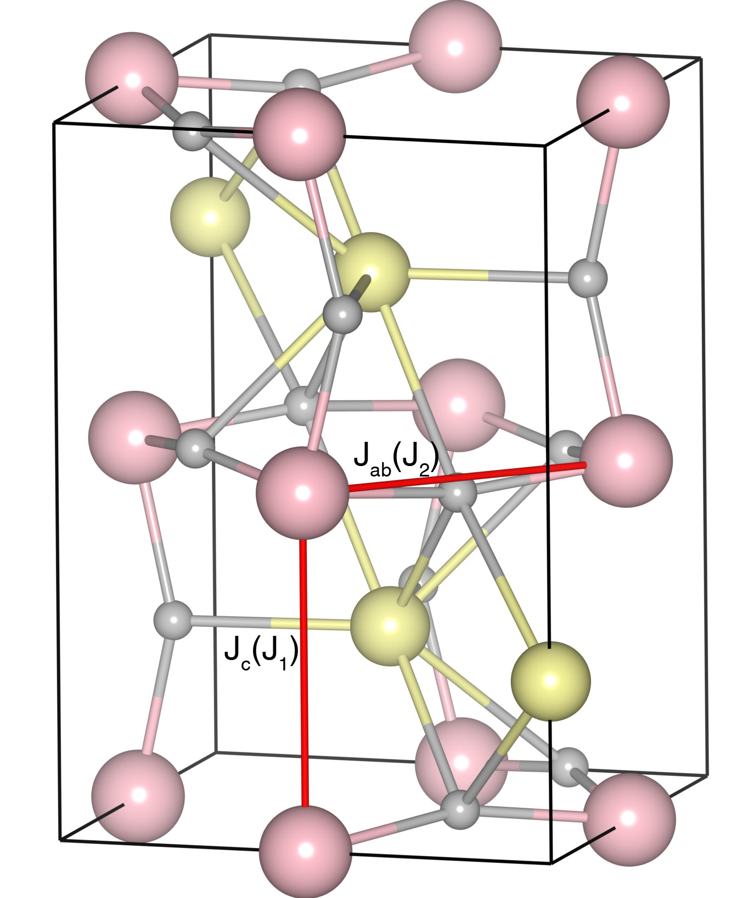

# LaFeO3

## Crystal and Heisenberg exchanges

| shell    | distance (A&#778;) | exchange J (meV) |
|----------|--------------|------------------|
| 1        | 3.920087     | -30.438          |
| 2        | 3.928332     | -30.438          |

## Monte Carlo, corrected Monte Carlo (TMC*) and Exp. transition temperature

| Texp (K) | TMC (K) | TMC* (K) | S   | Error (%) |
|----------------------|--------------------|--------------------------------|-----|-----------|
| 738.0                  | 504.0                | 705.6                          | 2.5 | 4.4       |

## INS data:
[Phys. Rev. B 78, 184417](https://journals.aps.org/prb/abstract/10.1103/PhysRevB.78.184417)

## Exp. transition temperature:
[J. Phys.: Condens. Matter 30 235802](https://iopscience.iop.org/article/10.1088/1361-648X/aac06b)
