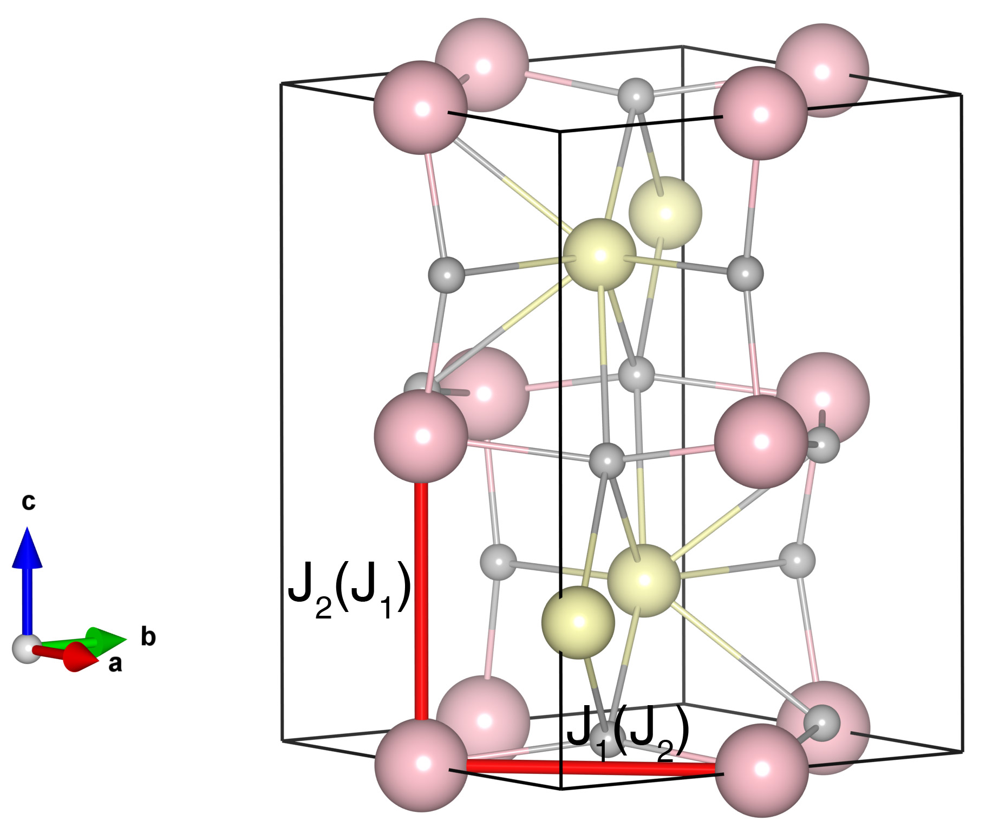

# LaMnO3

## Crystal and Heisenberg exchanges

| shell    | distance (A&#778;) | exchange J (meV) |
|----------|--------------|------------------|
| 1        | 3.846450     | -4.640           |
| 2        | 3.990191     | 6.640            |

## Monte Carlo, corrected Monte Carlo (TMC*) and Exp. transition temperature

| Texp (K) | TMC (K) | TMC* (K) | S   | Error (%) |
|----------------------|--------------------|--------------------------------|-----|-----------|
| 139.5                  | 101.0                | 151.5                          | 2.0 | 8.6       |

## INS data:
[Phys. Rev. B 54, 15149](https://journals.aps.org/prb/abstract/10.1103/PhysRevB.54.15149)

## Exp. transition temperature:
[Phys. Rev. B 54, 15149](https://journals.aps.org/prb/abstract/10.1103/PhysRevB.54.15149)
