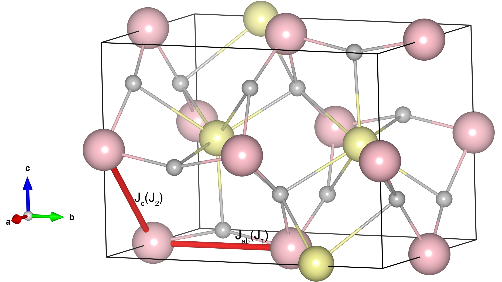

# LaVO3

## Crystal and Heisenberg exchanges

| shell    | distance (A&#778;) | exchange J (meV) |
|----------|--------------|------------------|
| 1        | 3.924340     | -7.800           |
| 2        | 3.927614     | 2.900            |

## Monte Carlo, corrected Monte Carlo (TMC*) and Exp. transition temperature

| Texp (K) | TMC (K) | TMC* (K) | S   | Error (%) |
|----------------------|--------------------|--------------------------------|-----|-----------|
| 150.0                  | 70.0                 | 140.0                          | 1.0 | 6.7       |

## INS data:
[Phys. Rev. B 78, 184417](https://journals.aps.org/prb/abstract/10.1103/PhysRevB.78.184417)

## Exp. transition temperature:
[j.matlet.2003.10.059](https://www.sciencedirect.com/science/article/abs/pii/S0167577X03008723)
