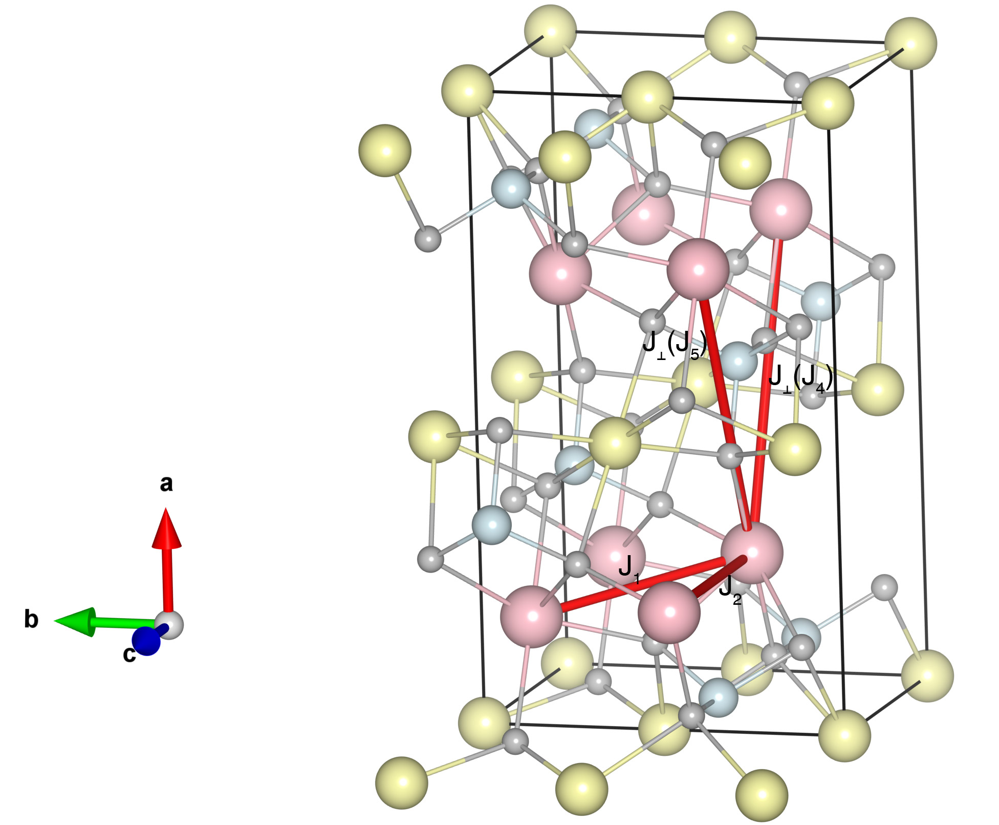

# LiFePO4

## Crystal and Heisenberg exchanges

| shell    | distance (A&#778;) | exchange J (meV) |
|----------|--------------|------------------|
| 1        | 3.870016     | -5.296           |
| 2        | 4.692000     | -2.160           |
| 4        | 5.579828     | 0.168            |
| 5        | 5.775865     | 0.168            |

## Monte Carlo, corrected Monte Carlo (TMC*) and Exp. transition temperature

| Texp (K) | TMC (K) | TMC* (K) | S   | Error (%) |
|----------------------|--------------------|--------------------------------|-----|-----------|
| 50.0                   | 41.0                 | 61.5                           | 2.0 | 23.0      |

## INS data:
[Phys. Rev. B 73, 024410](https://journals.aps.org/prb/abstract/10.1103/PhysRevB.73.024410)

## Exp. transition temperature:
[Phys. Rev. B 73, 024410](https://journals.aps.org/prb/abstract/10.1103/PhysRevB.73.024410)
