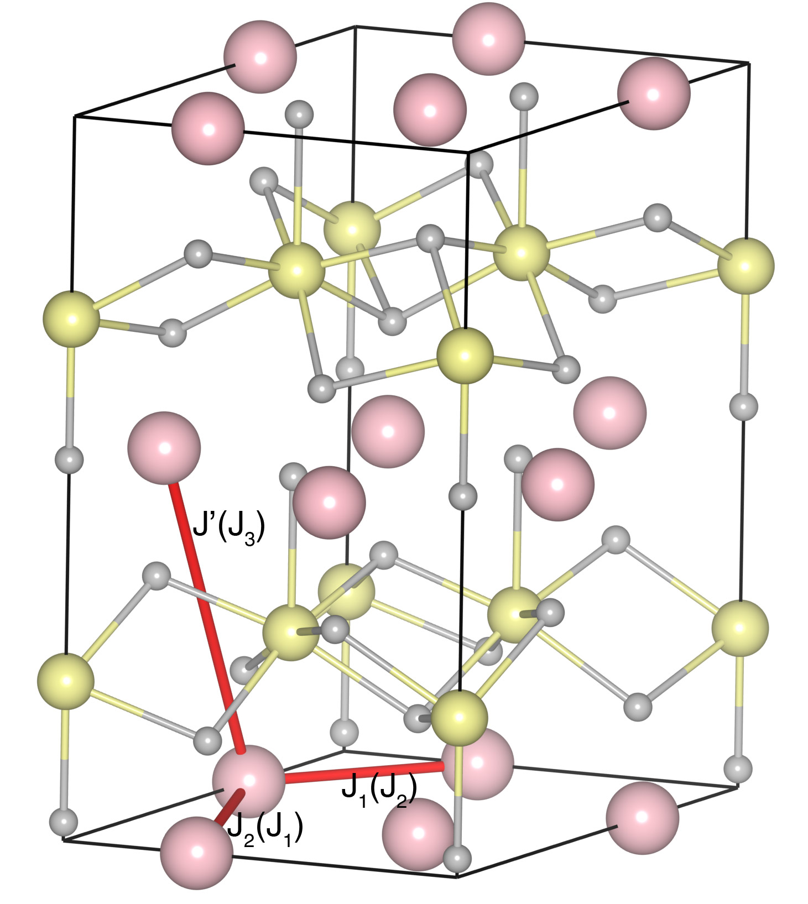

# LuMnO3

## Crystal and Heisenberg exchanges

| shell    | distance (A&#778;) | exchange J (meV) |
|----------|--------------|------------------|
| 1        | 3.461313     | -16.360          |
| 2        | 3.549942     | -6.160           |
| 4        | 6.045900     | 0.076            |

## Monte Carlo, corrected Monte Carlo (TMC*) and Exp. transition temperature

| Texp (K) | TMC (K) | TMC* (K) | S   | Error (%) |
|----------------------|--------------------|--------------------------------|-----|-----------|
| 87.5                   | 71.0                 | 106.5                          | 2.0 | 21.7      |

## INS data:
[Phys. Rev. B 82, 184420](https://journals.aps.org/prb/abstract/10.1103/PhysRevB.82.184420)

## Exp. transition temperature:
[Phys. Rev. B 82, 184420](https://journals.aps.org/prb/abstract/10.1103/PhysRevB.82.184420)
