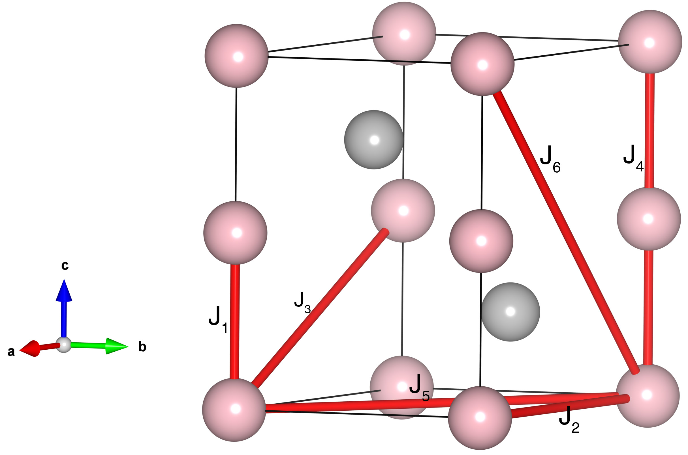

# MnBi

## Crystal and Heisenberg exchanges

| shell    | distance (A&#778;) | exchange J (meV) |
|----------|--------------|------------------|
| 1        | 3.059999     | -18.800          |
| 2        | 4.299999     | 2.440            |
| 3        | 5.277649     | 6.920            |
| 4        | 6.119998     | 0.480            |
| 5        | 7.447816     | 5.160            |
| 6        | 7.479597     | 2.520            |

## Monte Carlo, corrected Monte Carlo (TMC*) and Exp. transition temperature

| Texp (K) | TMC (K) | TMC* (K) | S   | Error (%) |
|----------------------|--------------------|--------------------------------|-----|-----------|
| 630.0                  | 394.0                | 591.0                          | 2.0 | 6.2       |

## INS data:
[Appl. Phys. Lett. 108, 192403](https://pubs.aip.org/aip/apl/article/108/19/192403/30972/Extended-magnetic-exchange-interactions-in-the)

## Exp. transition temperature:
[Appl. Phys. Lett. 108, 192403](https://pubs.aip.org/aip/apl/article/108/19/192403/30972/Extended-magnetic-exchange-interactions-in-the)
