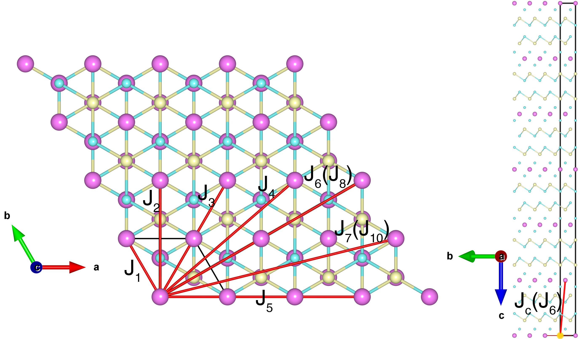

# MnBi2Te4

## Crystal and Heisenberg exchanges

| shell    | distance (A&#778;) | exchange J (meV) |
|----------|--------------|------------------|
| 1        | 4.309000     | 0.583            |
| 2        | 7.463407     | -0.083           |
| 3        | 8.618000     | 0.017            |
| 4        | 11.400542    | -0.008           |
| 5        | 12.927000    | 0.040            |
| 6        | 13.785998    | -0.163           |
| 8        | 14.926814    | 0.032            |
| 10       | 15.536321    | 0.020            |

## Monte Carlo, corrected Monte Carlo (TMC*) and Exp. transition temperature

| Texp (K) | TMC (K) | TMC* (K) | S   | Error (%) |
|----------------------|--------------------|--------------------------------|-----|-----------|
| 24.0                   | 16.0                 | 22.5                           | 2.5 | 6.7       |

## INS data:
[Phys. Rev. B 104, L220402](https://doi.org/10.1103/PhysRevB.104.L220402)

## Exp. transition temperature:
[Phys. Rev. B 104, L220402](https://doi.org/10.1103/PhysRevB.104.L220402)
