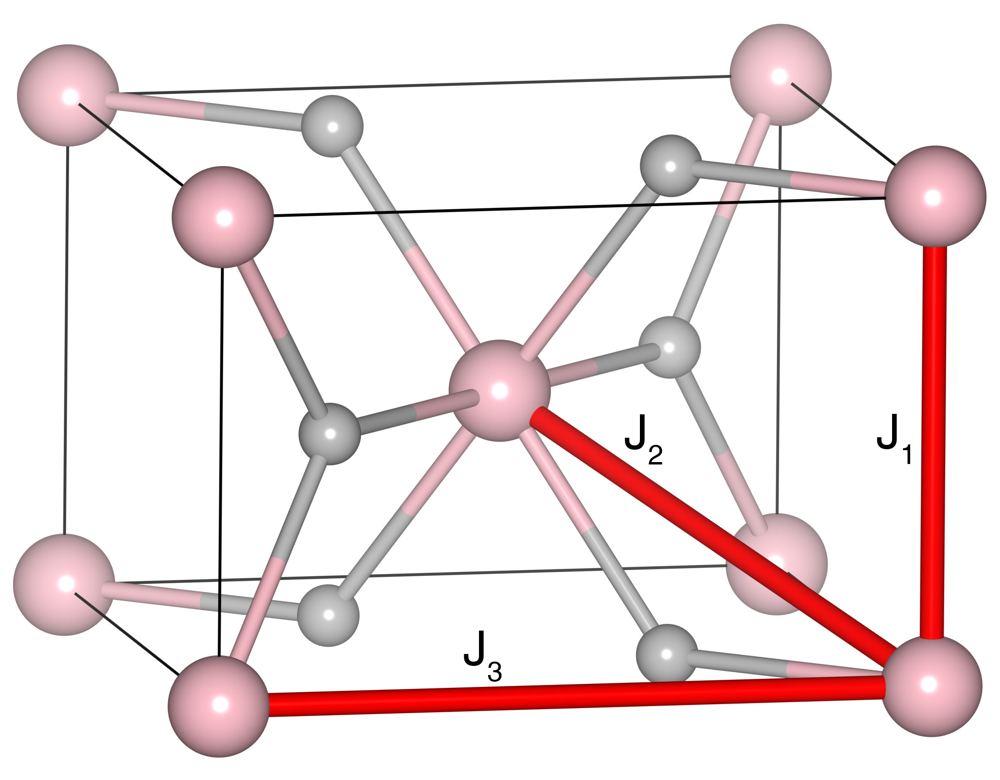

# MnF2

## Crystal and Heisenberg exchanges

| shell    | distance (A&#778;) | exchange J (meV) |
|----------|--------------|------------------|
| 1        | 3.308454     | 0.423            |
| 2        | 3.812044     | -1.889           |
| 3        | 4.856998     | 0.028            |

## Monte Carlo, corrected Monte Carlo (TMC*) and Exp. transition temperature

| Texp (K) | TMC (K) | TMC* (K) | S   | Error (%) |
|----------------------|--------------------|--------------------------------|-----|-----------|
| 67.0                   | 48.0                 | 67.2                           | 2.5 | 0.3       |

## INS data:
[arXiv:2412.03545v1](https://doi.org/10.48550/arXiv.2412.03545)

## Exp. transition temperature:
[arXiv:2412.03545v1](https://doi.org/10.48550/arXiv.2412.03545)
