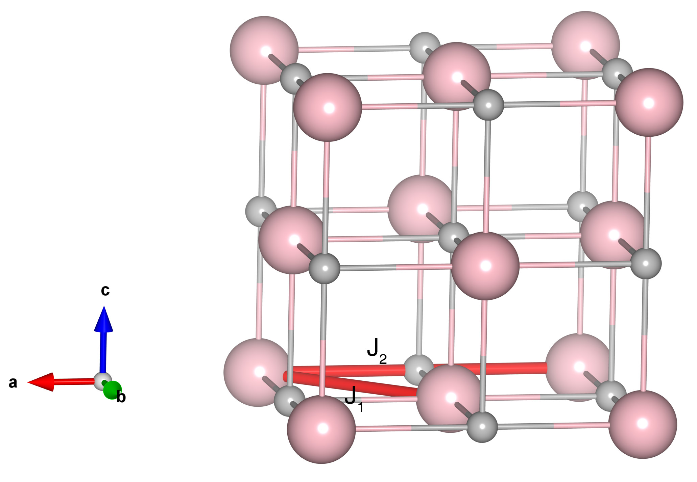

# MnO

## Crystal and Heisenberg exchanges

| shell    | distance (A&#778;) | exchange J (meV) |
|----------|--------------|------------------|
| 1        | 3.147332     | -4.812           |
| 2        | 4.451000     | -5.562           |

## Monte Carlo, corrected Monte Carlo (TMC*) and Exp. transition temperature

| Texp (K) | TMC (K) | TMC* (K) | S   | Error (%) |
|----------------------|--------------------|--------------------------------|-----|-----------|
| 117.0                  | 79.0                 | 110.6                          | 2.5 | 5.47      |

## INS data:
[Solid State Communications, 11, 391](https://www.sciencedirect.com/science/article/abs/pii/0038109872902554)

## Exp. transition temperature:
[Solid State Communications, 11, 391](https://www.sciencedirect.com/science/article/abs/pii/0038109872902554)
