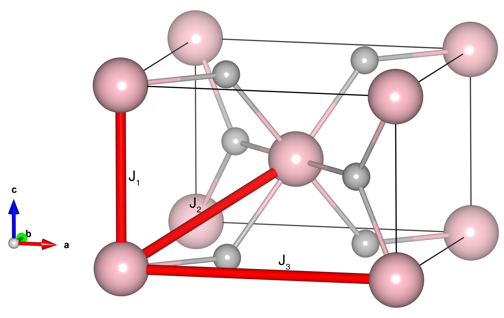

# MnO2

## Crystal and Heisenberg exchanges

| shell    | distance (A&#778;) | exchange J (meV) |
|----------|--------------|------------------|
| 1        | 2.865774     | 3.453            |
| 2        | 3.417664     | 2.134            |
| 3        | 4.387998     | -0.504           |

## Monte Carlo, corrected Monte Carlo (TMC*) and Exp. transition temperature

| Texp (K) | TMC (K) | TMC* (K) | S   | Error (%) |
|----------------------|--------------------|--------------------------------|-----|-----------|
| 92.0                   | 63.0                 | 105.0                          | 1.5 | 14.1      |

## INS data:
[J. Phys. Soc. Jpn. 30, pp. 1311](https://journals.jps.jp/doi/10.1143/JPSJ.30.1311)

## Exp. transition temperature:
[J. Phys. Soc. Jpn. 30, pp. 1311](https://journals.jps.jp/doi/10.1143/JPSJ.30.1311)
