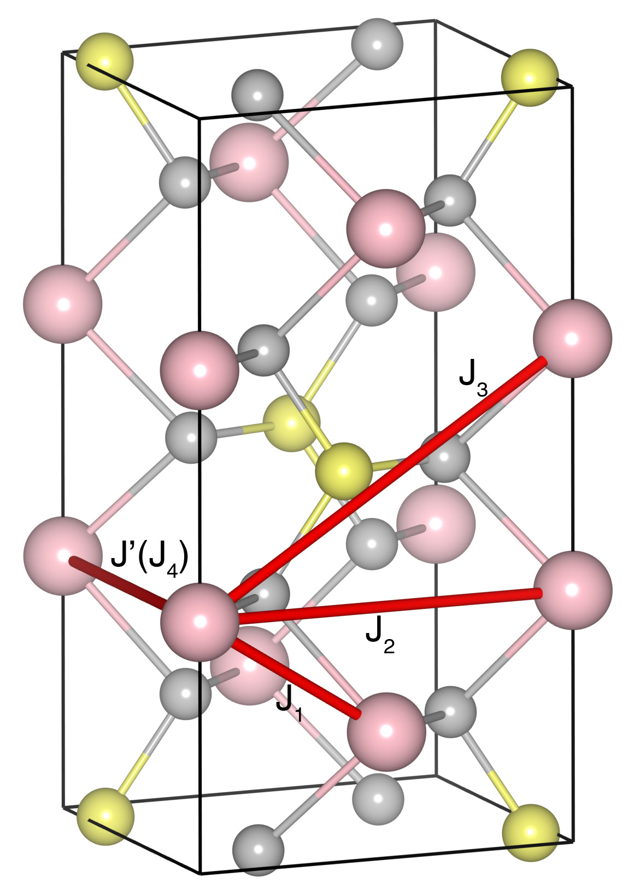

# MnPS3

## Crystal and Heisenberg exchanges

| shell    | distance (A&#778;) | exchange J (meV) |
|----------|--------------|------------------|
| 1        | 3.506200     | -9.625           |
| 2        | 3.507067     | -9.625           |
| 3        | 6.072013     | -0.875           |
| 4        | 6.076218     | -0.875           |
| 5        | 7.007541     | -2.250           |
| 6        | 7.015693     | -2.250           |
| 7        | 7.052871     | 0.024            |
| 8        | 7.062563     | 0.024            |

## Monte Carlo, corrected Monte Carlo (TMC*) and Exp. transition temperature

| Texp (K) | TMC (K) | TMC* (K) | S   | Error (%) |
|----------------------|--------------------|--------------------------------|-----|-----------|
| 78.0                   | 61.0                 | 85.4                           | 2.5 | 9.5       |

## INS data:
[J. Phys.: Condens. Matter 10 6417](https://iopscience.iop.org/article/10.1088/0953-8984/10/28/020)

## Exp. transition temperature:
[J. Phys.: Condens. Matter 10 6417](https://iopscience.iop.org/article/10.1088/0953-8984/10/28/020)
