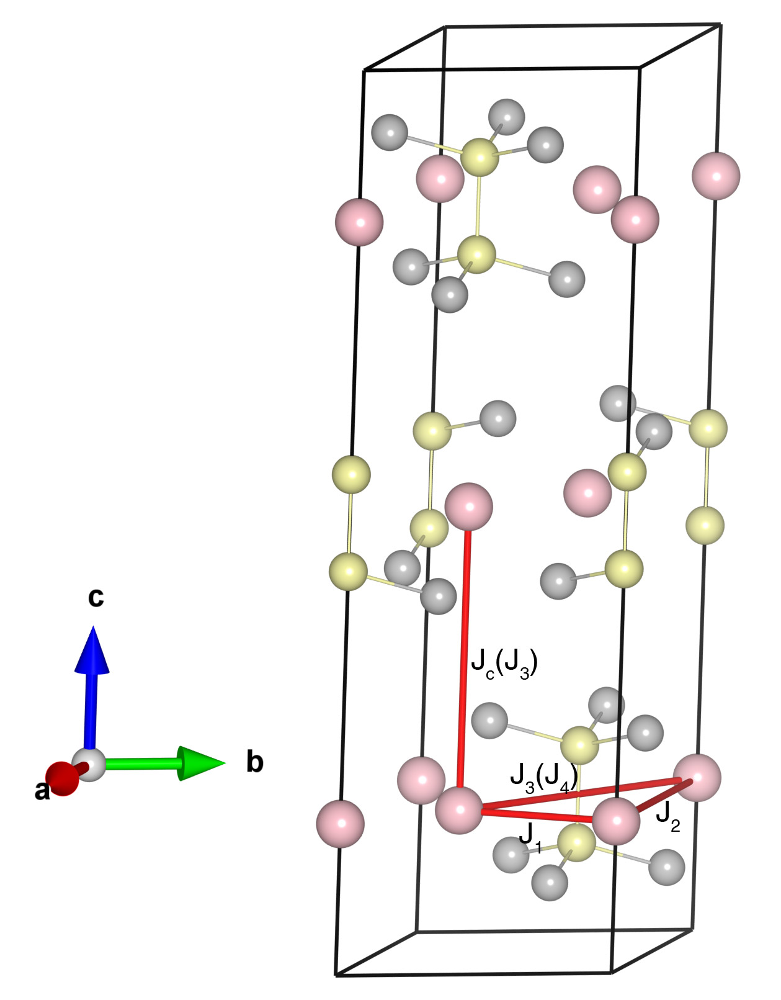

# MnPSe3

## Crystal and Heisenberg exchanges

| shell    | distance (A&#778;) | exchange J (meV) |
|----------|--------------|------------------|
| 1        | 3.694998     | -5.625           |
| 2        | 6.399561     | -0.375           |
| 3        | 6.944877     | -0.388           |
| 4        | 7.389681     | -2.375           |

## Monte Carlo, corrected Monte Carlo (TMC*) and Exp. transition temperature

| Texp (K) | TMC (K) | TMC* (K) | S   | Error (%) |
|----------------------|--------------------|--------------------------------|-----|-----------|
| 74.0                   | 52.0                 | 72.8                           | 2.5 | 1.6       |

## INS data:
[Phys. Rev. B 103, 024414](https://journals.aps.org/prb/abstract/10.1103/PhysRevB.103.024414)

## Exp. transition temperature:
[Phys. Rev. B 103, 024414](https://journals.aps.org/prb/abstract/10.1103/PhysRevB.103.024414)
