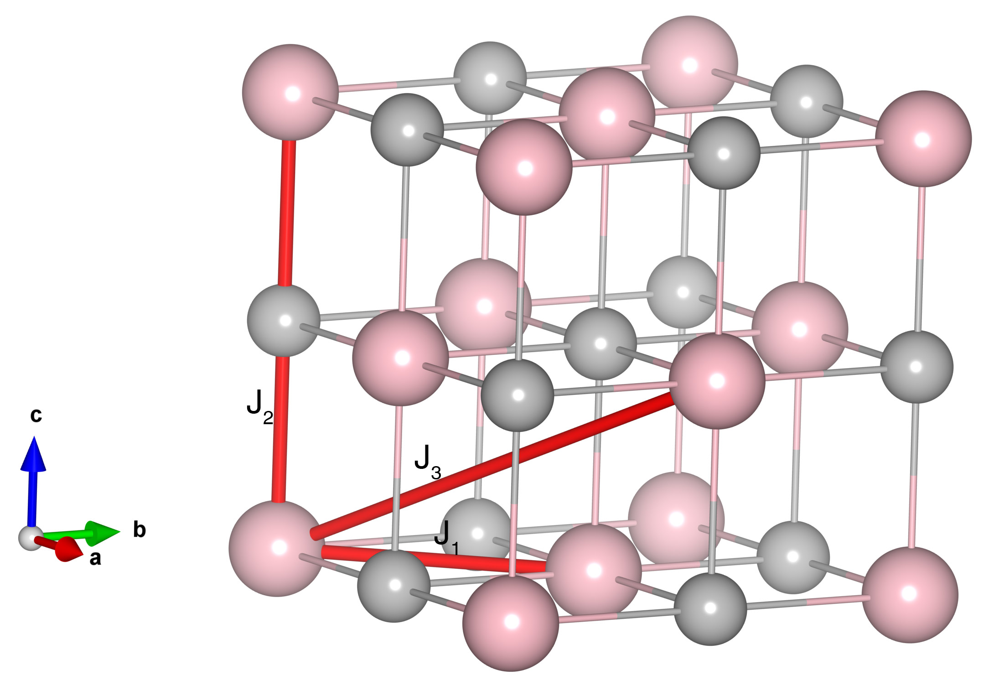

# MnS

## Crystal and Heisenberg exchanges

| shell    | distance (A&#778;) | exchange J (meV) |
|----------|--------------|------------------|
| 1        | 3.691096     | 1.688            |
| 2        | 5.219998     | -6.562           |
| 3        | 6.393165     | 1.188            |

## Monte Carlo, corrected Monte Carlo (TMC*) and Exp. transition temperature

| Texp (K) | TMC (K) | TMC* (K) | S   | Error (%) |
|----------------------|--------------------|--------------------------------|-----|-----------|
| 152.0                  | 105.0                | 147.0                          | 2.5 | 3.29      |

## INS data:
[J. Phys. Chem. C, 125, 16183](https://pubs.acs.org/doi/10.1021/acs.jpcc.1c02956)

## Exp. transition temperature:
[J. Phys. Chem. C, 125, 16183](https://pubs.acs.org/doi/10.1021/acs.jpcc.1c02956)
