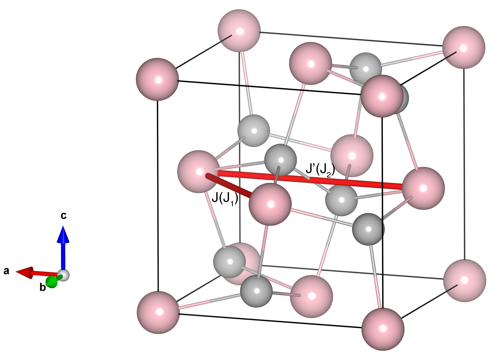

# MnS2

## Crystal and Heisenberg exchanges

| shell    | distance (A&#778;) | exchange J (meV) |
|----------|--------------|------------------|
| 1        | 4.301331     | -3.125           |
| 2        | 6.083000     | 0.312            |

## Monte Carlo, corrected Monte Carlo (TMC*) and Exp. transition temperature

| Texp (K) | TMC (K) | TMC* (K) | S   | Error (%) |
|----------------------|--------------------|--------------------------------|-----|-----------|
| 48.0                   | 25.0                 | 35.0                           | 2.5 | 27.1      |

## INS data:
[J. Phys.: Condens. Matter ](https://iopscience.iop.org/article/10.1088/1361-648X/aafaeb)

## Exp. transition temperature:
[J. Phys.: Condens. Matter ](https://iopscience.iop.org/article/10.1088/1361-648X/aafaeb)
