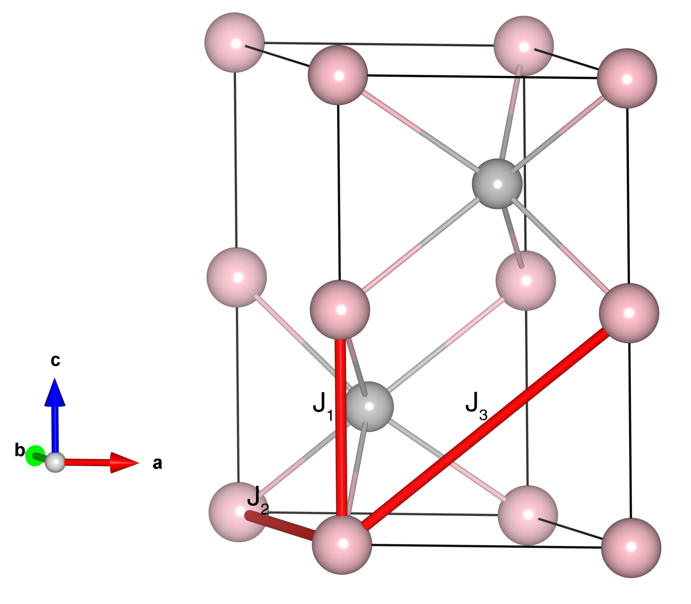

# MnTe

## Crystal and Heisenberg exchanges

| shell    | distance (A&#778;) | exchange J (meV) |
|----------|--------------|------------------|
| 1        | 3.351461     | -23.162          |
| 2        | 4.149998     | 0.725            |
| 3        | 5.334302     | -3.087           |

## Monte Carlo, corrected Monte Carlo (TMC*) and Exp. transition temperature

| Texp (K) | TMC (K) | TMC* (K) | S   | Error (%) |
|----------------------|--------------------|--------------------------------|-----|-----------|
| 310.0                  | 251.0                | 351.4                          | 2.5 | 13.35     |

## INS data:
[Phys. Rev. B 73, 104403](https://journals.aps.org/prb/abstract/10.1103/PhysRevB.73.104403)

## Exp. transition temperature:
[Phys. Rev. B 73, 104403](https://journals.aps.org/prb/abstract/10.1103/PhysRevB.73.104403)
